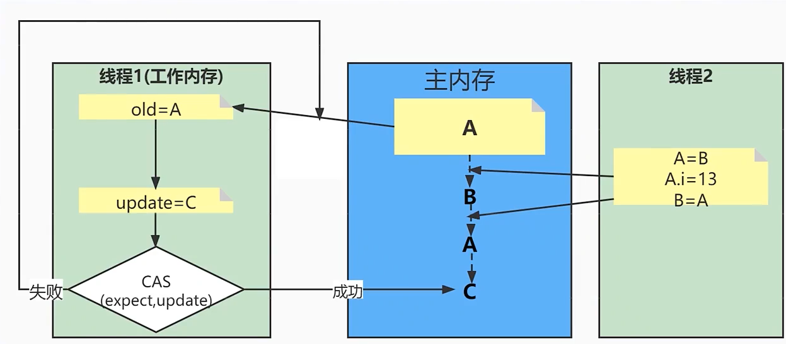
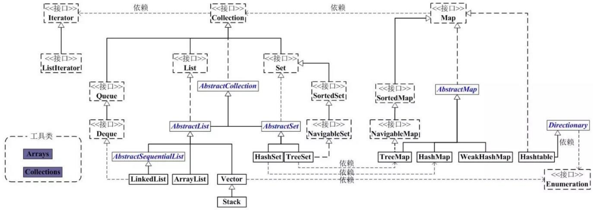
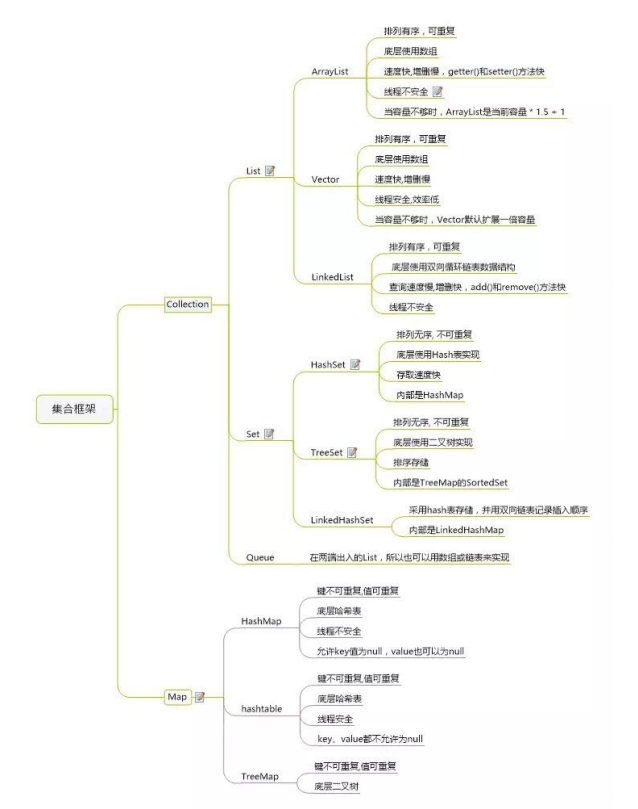
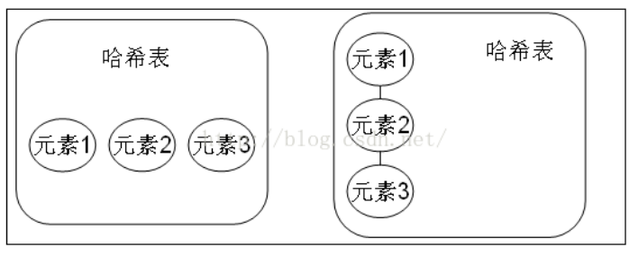
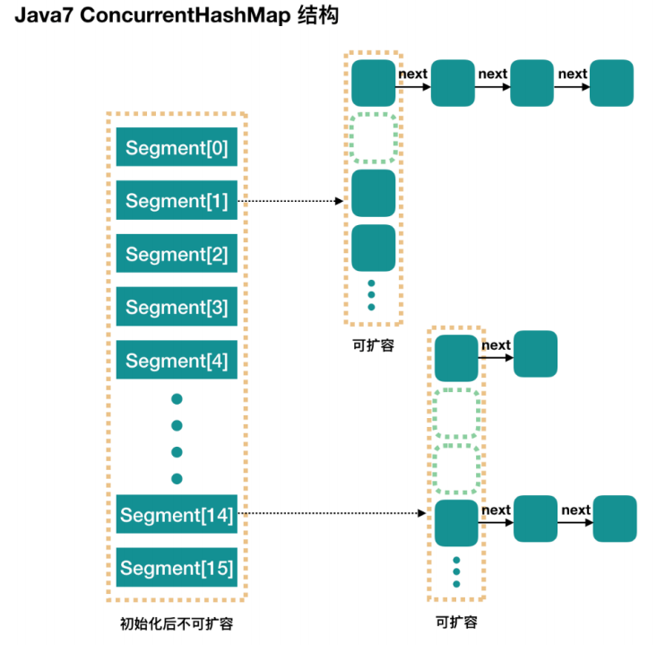

# Java多线程

## 创建线程的方式

（1）继承Thread类

```java
public class FirstThreadTest extends Thread {
    int i = 0;
    //重写run方法，run方法的方法体就是现场执行体
    public void run() {
        for (; i < 100; i++) {
            System.out.println(getName() + "  " + i);
        }
    }
    public static void main(String[] args) {
        for (int i = 0; i < 100; i++) {
            System.out.println(Thread.currentThread().getName() + "  : " + i);
            if (i == 50) {
                new FirstThreadTest().start();
                new FirstThreadTest().start();
            }
        }
    }
}
```

（2）实现Runnable接口

```java
public class RunnableThreadTest implements Runnable{
    private int i;
    public void run(){
        for(i = 0;i <100;i++)
        {
            System.out.println(Thread.currentThread().getName()+" "+i);
        }
    }
    public static void main(String[] args)
    {
        for(int i = 0;i < 100;i++)
        {
            System.out.println(Thread.currentThread().getName()+" "+i);
            if(i==20)
            {
                RunnableThreadTest rtt = new RunnableThreadTest();
                new Thread(rtt,"新线程1").start();
                new Thread(rtt,"新线程2").start();
            }
        }
    }
}
```

(3)通过Callable和Future创建线程

1、创建Callable接口的实现类，并实现call()方法，该call()方法将作为线程执行体，并且有返回值。

2、创建Callable实现类的实例，使用FutureTask类来包装Callable对象，该FutureTask对象封装了该Callable对象的call()方法的返回值。

3、使用FutureTask对象作为Thread对象的target创建并启动新线程。

4、调用FutureTask对象的get()方法来获得子线程执行结束后的返回值

```java
import java.util.concurrent.Callable;
import java.util.concurrent.ExecutionException;
import java.util.concurrent.FutureTask;

public class CallableThreadTest implements Callable<Integer> {
	public static void main(String[] args) {
		CallableThreadTest ctt = new CallableThreadTest();
		FutureTask<Integer> ft = new FutureTask<>(ctt);
		for (int i = 0; i < 100; i++) {
			System.out.println(Thread.currentThread().getName() + " 的循环变量i的值" + i);
			if (i == 20) {
				new Thread(ft, "有返回值的线程").start();
			}
		}
		try {
			System.out.println("子线程的返回值：" + ft.get());
		} catch (InterruptedException e) {
			e.printStackTrace();
		} catch (ExecutionException e) {
			e.printStackTrace();
		}

	}
	@Override
	public Integer call() throws Exception {
		int i = 0;
		for (; i < 100; i++) {
			System.out.println(Thread.currentThread().getName() + " " + i);
		}
		return i;
	}
}
```

## 线程池

如果 100 个并发同时访问主线程也就是短时间就启动了 200 个线程，200 个线程同时工作，逻辑上是没有任何问题的，但是这样做对系统资源的开销很大。基于这样的考虑，就要考虑启用线程池，线程池里有很多可用线程资源，如果需要就直接从线程池里拿就是。当不用的时候，线程池会自动帮我们管理。

所以**使用线程池主要有以下两个好处：**

1. 减少在创建和销毁线程上所花的时间以及系统资源的开销 
2. 如不使用线程池，有可能造成系统创建大量线程而导致消耗完系统内存 。

**自定义线程池**

定义单例线程池：

```java
public class MyPool {
	private static MyPool myPool = null;
	//单例线程池中有两种具体的线程池
	private ThreadPoolExecutor threadPool = null;
	private ScheduledThreadPoolExecutor scheduledPool=null;

	public ThreadPoolExecutor getThreadPool(){
		return threadPool;
	}

	public ScheduledThreadPoolExecutor getScheduledPool(){
		return scheduledPool;
	}

	//设置线程池的各个参数的大小
	private int corePoolSize = 10;//池中所保存的线程数，包括空闲线程。
	private int maximumPoolSize=20;//池中允许的最大线程数。
	private long keepA1iveTime=3;//当线程数大于核心时，此为终止前多余的空闲线程等待新任务的最长时间。
	private int scheduledPoolSize=10;

	private static synchronized void create(){
		if (myPool==null){
			myPool=new MyPool();
		}
	}

	public static MyPool getInstance(){
		if (myPool==null){
			create();
		}
		return myPool;
	}

	private MyPool(){
		// 实例化线程池，这里使用的 LinkedBlockingQueue 作为 workQueue ，使用 DiscardOldestPolicy 作为 handler
		this.threadPool=new ThreadPoolExecutor(corePoolSize,maximumPoolSize,
				keepA1iveTime,
				TimeUnit.SECONDS,
				new LinkedBlockingDeque<>(),
				new ThreadPoolExecutor.CallerRunsPolicy());// 不在新线程中执行任务，而是由调用者所在的线程来执行
		// 实例化计划任务线程池
		this.scheduledPool = new ScheduledThreadPoolExecutor(scheduledPoolSize);
	}
}
```

创建线程池的主要参数说明:

1. `corePoolSize（int）`：线程池中保持的线程数量，包括空闲线程在内。也就是线程池释放的最小线程数量界限。

2. `maximumPoolSize（int）`: 线程池中嫩容纳最大线程数量。

3. `keepAliveTime(long)`: 空闲线程保持在线程池中的时间，当线程池中线程数量大于 corePoolSize 的时候。

4. `unit(TimeUnit枚举类)`: 上面参数时间的单位，可以是分钟，秒，毫秒等等。

5. `workQueue（BlockingQueue）`: 任务队列，当线程任务提交到线程池以后，首先放入队列中，然后线程池按照该任务队列依次执行相应的任务。可以使用的 workQueue 有很多，比如：LinkedBlockingQueue 等等。

6. `threadFactory(ThreadFactory类)`: 新线程产生工厂类。

7. `handler（RejectedExecutionHandler类）`: 当提交线程拒绝执行、异常的时候，处理异常的类。该类取值如下：(注意都是内部类) 

   

   `ThreadPoolExecutor.AbortPolicy`: 丢弃任务并抛出RejectedExecutionException 异常。 

   `ThreadPoolExecutor.DiscardPolicy`：也是丢弃任务，但是不抛出异常。

   `ThreadPoolExecutor.DiscardOldestPolicy`：丢弃队列最前面的任务，然后重新尝试执行任务，重复此过程。 

   `ThreadPoolExecutor.CallerRunsPolicy`：由调用线程处理该任务。

获取线程池并添加任务:

```java
	public void testThreadPool() {

		ThreadPoolExecutor pool1 = (ThreadPoolExecutor) Executors.newCachedThreadPool();

		pool1.execute(() -> System.out.println("快捷线程池中的线程！"));

		ThreadPoolExecutor pool2 = MyPool.getInstance().getThreadPool();
		pool2.execute(() -> {
			System.out.println("pool2 普通线程池中的线程！");
			try {
				Thread.sleep(30 * 1000);} catch (InterruptedException e) {e.printStackTrace();
			}

		});
		System.out.println("pool2 poolSize:" +pool2.getPoolSize());
		System.out.println("pool2 corePoolSize:" +pool2.getCorePoolSize());
		System.out.println("pool2 largestPoolSize:" +pool2.getLargestPoolSize());
		System.out.println("pool2 maximumPoolSize:" +pool2.getMaximumPoolSize());

		ScheduledThreadPoolExecutor pool3 = MyPool.getInstance().getScheduledPool();
		pool3.scheduleAtFixedRate(() -> System.out.println("计划任务线程池中的线程！"), 0, 5000, TimeUnit.MILLISECONDS);
	}
```

- **JDK 提供的常用线程池**

java 提供了几种常用的线程池，可以快捷的供程序员使用

1. `newFixedThreadPool` 创建固定大小数量线程池，数量通过传入的参数决定。
2. `newSingleThreadExecutor` 创建一个线程容量的线程池，所有的线程依次执行，相当于创建固定数量为 1 的线程池。
3. `newCachedThreadPool` 创建可缓存的线程池，没有最大线程限制（实际上是 Integer.MAX_VALUE）。如果用空闲线程等待时间超过一分钟，就关闭该线程。
4. `newScheduledThreadPool` 创建计划 (延迟) 任务线程池, 线程池中的线程可以让其在特定的延迟时间之后执行，也可以以固定的时间重复执行（周期性执行）。相当于以前的 Timer 类的使用。
5. `newSingleThreadScheduledExecutor` 创建单线程池延迟任务，创建一个线程容量的计划任务。

- **Spring Boot中使用线程池**

如果使用 spring 框架的朋友，可以直接使用 spring 封装的线程池，由 spring 容器管理。 Spring Boot中有两种方式配置线程池，一种是 **自定义配置**，二种是 **修改原生 spring 异步线程池的装配**。

**1. 自定义线程池**

```java
@Configuration
@EnableAsync
// 开启线程池
public class TaskExecutePool {
    @Autowired
    private TaskThreadPoolConfig config;

    @Bean
    public Executor myTaskAsyncPool() {
        ThreadPoolTaskExecutor executor = new ThreadPoolTaskExecutor();
        // 核心线程池大小
        executor.setCorePoolSize(config.getCorePoolSize());
        // 最大线程数
        executor.setMaxPoolSize(config.getMaxPoolSize());
        // 队列容量
        executor.setQueueCapacity(config.getQueueCapacity());
        // 活跃时间
        executor.setKeepAliveSeconds(config.getKeepAliveSeconds());
        // 线程名字前缀
        executor.setThreadNamePrefix("MyExecutor-");
        
        // setRejectedExecutionHandler：当 pool 已经达到 max size 的时候，如何处理新任务
        // CallerRunsPolicy：不在新线程中执行任务，而是由调用者所在的线程来执行
        executor.setRejectedExecutionHandler(new ThreadPoolExecutor.CallerRunsPolicy());
        executor.initialize();
        return executor;
    }
}
```


## Runnable接口和Callable接口的区别

Runnable接口中的run()方法的返回值是void，它做的事情只是纯粹地去执行run()方法中的代码而已；Callable接口中的call()方法是有返回值的，是一个泛型，和Future、FutureTask配合可以用来获取异步执行的结果。

## CAS

CAS，全称为Compare and Swap，即比较-替换。假设有三个操作数：**内存值V、旧的预期值A、要修改的值B，当且仅当预期值A和内存值V相同时，才会将内存值修改为B并返回true，否则什么都不做并返回false**。当然CAS一定要volatile变量配合，这样才能保证每次拿到的变量是主内存中最新的那个值，否则旧的预期值A对某条线程来说，永远是一个不会变的值A，只要某次CAS操作失败，永远都不可能成功。


问题：会出现ABA问题

比如说，一个线程1从内存位置V中取出A，这个时候另一个线程2也从内存中取出A，并且线程2进行了一些操作将值变成了B，然后线程2又将V位置的数据变成A，这个时候线程1进行CAS操作发现内存中仍然是A，然后线程1操作成功。



解决办法就是新增一种机制，那就是修改版本号，每进行一次修改就增加一次版本号，在最后对比一下版本号是否是线程初始读取的版本号，如果是则成功，否则自旋再次重复上述过程。

当并发过多时会出现CAS多次自旋，这时候就要加重量级锁

# 锁

### volatile

（1）使用volatile关键字修饰的变量，保证了其在多线程之间的可见性，即每次读取到volatile变量，一定是最新的数据。

（2）禁止语义重排序

### synchronized


# JVM虚拟机


# 集合

集合类存放于 Java.util 包中，主要有 3 种：set(集）、list(列表包含 Queue）和 map(映射)。

1. Collection：Collection 是集合 List、Set、Queue 的最基本的接口。

2. Iterator：迭代器，可以通过迭代器遍历集合中的数据

3. Map：是映射表的基础接口





## List

### ArrayList（数组）

​		ArrayList 是最常用的 List 实现类，内部是通过数组实现的，它允许对元素进行快速随机访问。数组的缺点是每个元素之间不能有间隔，当数组大小不满足时需要增加存储能力，就要将已经有数组的数据复制到新的存储空间中。当从 ArrayList 的中间位置插入或者删除元素时，需要对数组进行复制、移动、代价比较高。因此，它适合随机查找和遍历，不适合插入和删除。

### Vector（数组实现、线程同步）

​		Vector 与 ArrayList 一样，也是通过数组实现的，不同的是它支持线程的同步，即某一时刻只有一个线程能够写 Vector，避免多线程同时写而引起的不一致性，但实现同步需要很高的花费，因此，访问它比访问 ArrayList 慢。

### LinkList（链表）

​		LinkedList 是用链表结构存储数据的，很适合数据的动态插入和删除，随机访问和遍历速度比较慢。另外，他还提供了 List 接口中没有定义的方法，专门用于操作表头和表尾元素，可以当作堆栈、队列和双向队列使用。

## Set

​		Set 注重独一无二的性质,该体系集合用于存储无序(存入和取出的顺序不一定相同)元素，值不能重复。对象的相等性本质是对象 hashCode 值（java 是依据对象的内存地址计算出的此序号）判断的，如果想要让两个不同的对象视为相等的，就必须覆盖 Object 的 hashCode 方法和 equals 方法。

### HashSet（Hash表）

​		哈希表边存放的是哈希值。HashSet 存储元素的顺序并不是按照存入时的顺序（和 List 显然不同） 而是按照哈希值来存的所以取数据也是按照哈希值取得。元素的哈希值是通过元素的hashcode 方法来获取的, HashSet 首先判断两个元素的哈希值，如果哈希值一样，接着会比较equals 方法 如果 equls 结果为 true ，HashSet 就视为同一个元素。如果 equals 为 false 就不是同一个元素。

​		哈希值相同 equals 为 false 的元素是怎么存储呢,就是在同样的哈希值下顺延（可以认为哈希值相同的元素放在一个哈希桶中）。也就是哈希一样的存一列。如图 1 表示 hashCode 值不相同的情况；图 2 表示 hashCode 值相同，但 equals 不相同的情况。



​		HashSet 通过 hashCode 值来确定元素在内存中的位置。一个 hashCode 位置上可以存放多个元

素。

### TreeSet（二叉树）

1. TreeSet()是使用二叉树的原理对新 add()的对象按照指定的顺序排序（升序、降序），每增加一个对象都会进行排序，将对象插入的二叉树指定的位置。

2. Integer 和 String 对象都可以进行默认的 TreeSet 排序，而自定义类的对象是不可以的，自己定义的类必须实现 Comparable 接口，并且覆写相应的 compareTo()函数，才可以正常使用。

3. 在覆写 compare()函数时，要返回相应的值才能使 TreeSet 按照一定的规则来排序

4. 比较此对象与指定对象的顺序。如果该对象小于、等于或大于指定对象，则分别返回负整数、零或正整数。

### LinkHashSet（HashSet+LinkedHashMap）

​		对于 LinkedHashSet 而言，它继承与 HashSet、又基于 LinkedHashMap 来实现的。LinkedHashSet 底层使用 LinkedHashMap 来保存所有元素，它继承与 HashSet，其所有的方法操作上又与 HashSet 相同，因此LinkedHashSet 的实现上非常简单，只提供了四个构造方法，并通过传递一个标识参数，调用父类的构造器，底层构造一个 LinkedHashMap 来实现，在相关操作上与父类 HashSet 的操作相同，直接调用父类 HashSet 的方法即可。

## Map

### HashMap（数组+链表+红黑树）

​		HashMap 根据键的 hashCode 值存储数据，大多数情况下可以直接定位到它的值，因而具有很快的访问速度，但遍历顺序却是不确定的。 HashMap 最多只允许一条记录的键为 null，允许多条记录的值为 null。HashMap 非线程安全，即任一时刻可以有多个线程同时写 HashMap，可能会导致数据的不一致。如果需要满足线程安全，可以用 Collections 的 synchronizedMap 方法使HashMap 具有线程安全的能力，或者使用ConcurrentHashMap。我们用下面这张图来介绍HashMap 的结构

### ConcurrentHashMap

**Segment** **段**

ConcurrentHashMap 和 HashMap 思路是差不多的，但是因为它支持并发操作，所以要复杂一些。整个 ConcurrentHashMap 由一个个 Segment 组成，Segment 代表”部分“或”一段“的意思，所以很多地方都会将其描述为分段锁。注意，行文中，我很多地方用了“槽”来代表一个segment。

**线程安全（Segment 继承 ReentrantLock 加锁）**

简单理解就是，ConcurrentHashMap 是一个 Segment 数组，Segment 通过继承ReentrantLock 来进行加锁，所以每次需要加锁的操作锁住的是一个 segment，这样只要保证每个 Segment 是线程安全的，也就实现了全局的线程安全。



**并行度（默认16）**

​		concurrencyLevel：并行级别、并发数、Segment 数，怎么翻译不重要，理解它。默认是 16，也就是说 ConcurrentHashMap 有 16 个 Segments，所以理论上，这个时候，最多可以同时支持 16 个线程并发写，只要它们的操作分别分布在不同的 Segment 上。这个值可以在初始化的时候设置为其他值，但是一旦初始化以后，它是不可以扩容的。再具体到每个 Segment 内部，其实每个 Segment 很像之前介绍的 HashMap，不过它要保证线程安全，所以处理起来要麻烦些。