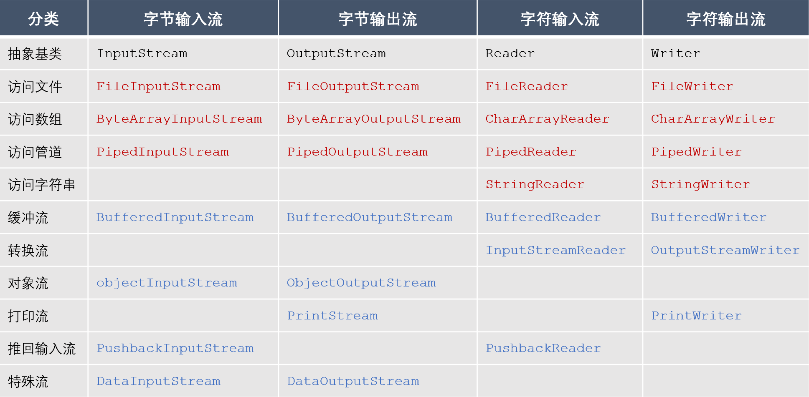

#### 介绍一下Java中的IO流

**参考答案**

IO（Input Output）用于实现对数据的输入与输出操作，Java把不同的输入/输出源（键盘、文件、网络等）抽象表述为流（Stream）。流是从起源到接收的有序数据，有了它程序就可以采用同一方式访问不同的输入/输出源。

- 按照数据流向，可以将流分为输入流和输出流，其中输入流只能读取数据、不能写入数据，而输出流只能写入数据、不能读取数据。
- 按照数据类型，可以将流分为字节流和字符流，其中字节流操作的数据单元是8位的字节，而字符流操作的数据单元是16位的字符。
- 按照处理功能，可以将流分为节点流和处理流，其中节点流可以直接从/向一个特定的IO设备（磁盘、网络等）读/写数据，也称为低级流，而处理流是对节点流的连接或封装，用于简化数据读/写功能或提高效率，也称为高级流。

Java提供了大量的类来支持IO操作，下表给大家整理了其中比较常用的一些类。其中，黑色字体的是抽象基类，其他所有的类都继承自它们。红色字体的是节点流，蓝色字体的是处理流。

根据命名很容易理解各个流的作用：

- 以File开头的文件流用于访问文件；
- 以ByteArray/CharArray开头的流用于访问内存中的数组；
- 以Piped开头的管道流用于访问管道，实现进程之间的通信；
- 以String开头的流用于访问内存中的字符串；
- 以Buffered开头的缓冲流，用于在读写数据时对数据进行缓存，以减少IO次数；
- InputStreamReader、InputStreamWriter是转换流，用于将字节流转换为字符流；
- 以Object开头的流是对象流，用于实现对象的序列化；
- 以Print开头的流是打印流，用于简化打印操作；
- 以Pushback开头的流是推回输入流，用于将已读入的数据推回到缓冲区，从而实现再次读取；
- 以Data开头的流是特殊流，用于读写Java基本类型的数据。

#### 怎么用流打开一个大文件？

打开大文件，应避免直接将文件中的数据全部读取到内存中，可以采用分次读取的方式。

1. 使用缓冲流。缓冲流内部维护了一个缓冲区，通过与缓冲区的交互，减少与设备的交互次数。使用缓冲输入流时，它每次会读取一批数据将缓冲区填满，每次调用读取方法并不是直接从设备取值，而是从缓冲区取值，当缓冲区为空时，它会再一次读取数据，将缓冲区填满。使用缓冲输出流时，每次调用写入方法并不是直接写入到设备，而是写入缓冲区，当缓冲区填满时它会自动刷入设备。
2. 使用NIO。NIO采用内存映射文件的方式来处理输入/输出，NIO将文件或文件的一段区域映射到内存中，这样就可以像访问内存一样来访问文件了（这种方式模拟了操作系统上的虚拟内存的概念），通过这种方式来进行输入/输出比传统的输入/输出要快得多。

#### 介绍一下Java的序列化与反序列化

序列化机制可以将对象转换成字节序列，这些字节序列可以保存在磁盘上，也可以在网络中传输，并允许程序将这些字节序列再次恢复成原来的对象。其中，对象的序列化（Serialize），是指将一个Java对象写入IO流中，对象的反序列化（Deserialize），则是指从IO流中恢复该Java对象。

若对象要支持序列化机制，则它的类需要实现Serializable接口，该接口是一个标记接口，它没有提供任何方法，只是标明该类是可以序列化的，Java的很多类已经实现了Serializable接口，如包装类、String、Date等。

若要实现序列化，则需要使用对象流ObjectInputStream和ObjectOutputStream。其中，在序列化时需要调用ObjectOutputStream对象的writeObject()方法，以输出对象序列。在反序列化时需要调用ObjectInputStream对象的readObject()方法，将对象序列恢复为对象。