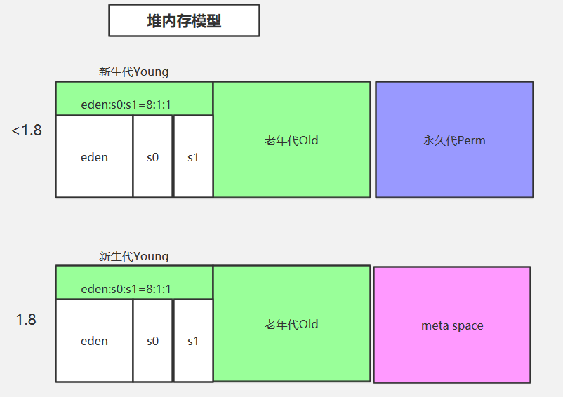

## JVM 的主要组成部分及其作用

- 类加载器（ClassLoader）
- 运行时数据区（Runtime Data Area）
- 执行引擎（Execution Engine）
- 本地库接口（Native Interface）

组件的作用： 首先通过类加载器（ClassLoader）会加载类文件到内存，Class loader只管加载，只要符合文件结构就加载。运行时数据区（Runtime Data Area)是jvm的重点，我们所有所写的程序都被加载到这里，之后才开始运行。而字节码文件只是 JVM 的一套指令集规范，并不能直接交个底层操作系统去执行，因此需要特定的命令解析器执行引擎（Execution Engine），将字节码翻译成底层系统指令，再交由 CPU 去执行，而这个过程中需要调用其他语言的本地库接口（Native Interface）来融合不同的语言为java所用,从而实现整个程序的功能。

## JVM 运行时数据区

- 程序计数器

  指向当前线程执行的字节码指令的地址（ 行号 ）。 这样做的**用处是多线程操作时， 挂起的线程在重新激活后能够知道上次执行的位置。**

- 虚拟机栈

  存储当前线程执行方法时所需要的数据，指令，返回地址。因此一个线程独享一块虚拟机栈 ，栈中内存的单位是栈帧。 每个栈帧中都拥有：局部变量表、操作数栈、动态链接、方法出口信息。

- 本地方法栈

  本地方法栈为虚拟机使用到的 Native 方法服务。

- 堆

  唯一目的就是存放对象实例，几乎所有的对象实例都在这里分配内存。 详见堆内存模型。

- 方法区

  用于存放已被加载的类信息、常量、静态变量、即时编译器编译后的代码等数据。方法区是一个 JVM 规范，永久代与元空间都是其一种实现方式。

  

## 堆

堆内存模型：

**此内存区域的唯一目的就是存放对象实例，几乎所有的对象实例以及数组都在这里分配内存。**

## 堆和栈的区别

1. 栈内存存储的是局部变量而堆内存存储的是实体；
2. 栈内存的更新速度要快于堆内存，因为局部变量的生命周期很短；
3. 栈内存存放的变量生命周期一旦结束就会被释放，而堆内存存放的实体会被垃圾回收机制不定时的回收。、

#### 类存放在哪里？

方法区

方法区（Method Area）与Java堆一样，是各个线程共享的内存区域，它用于存储已被虚拟机加载的**类型信息**、常量、静态变量、即时编译器编译后的代码缓存等数据。虽然《Java虚拟机规范》中把方法区描述为堆的一个逻辑部分，但是它却有一个别名叫作“非堆”（Non-Heap），目的是与Java堆区分开来。

#### 局部变量存放在哪里？

存放在栈帧中

每个方法被执行的时候，Java虚拟机都会同步创建一个栈帧（Stack Frame）用于存储**局部变量表**、操作数栈、动态连接、方法出口等信息。每一个方法被调用直至执行完毕的过程，就对应着一个栈帧在虚拟机栈中从入栈到出栈的过程。

**局部变量表**存放了编译期可知的各种Java虚拟机基本数据类型（boolean、byte、char、short、int、float、long、double）、对象引用（reference类型，它并不等同于对象本身，可能是一个指向对象起始地址的引用指针，也可能是指向一个代表对象的句柄或者其他与此对象相关的位置）和returnAddress类型（指向了一条字节码指令的地址）。
