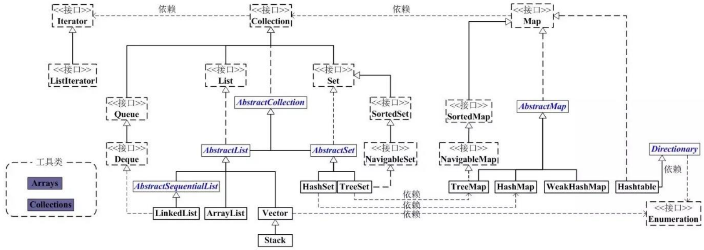
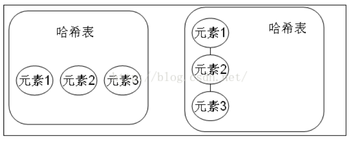
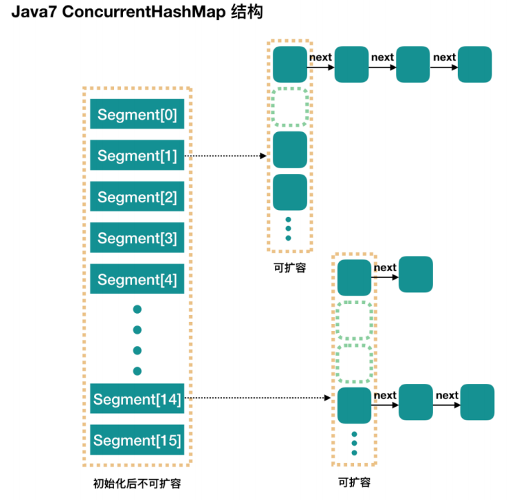

# 集合

集合类存放于 Java.util 包中，主要有 3 种：set(集）、list(列表包含 Queue）和 map(映射)。

1. Collection：Collection 是集合 List、Set、Queue 的最基本的接口。

2. Iterator：迭代器，可以通过迭代器遍历集合中的数据

3. Map：是映射表的基础接口

## List 和 Set，Map 的区别

- List 以索引来存取元素，有序的，元素是允许重复的，可以插入多个null。
- Set 不能存放重复元素，无序的，只允许一个null
- Map 保存键值对映射，映射关系可以一对一、多对一
- List 有基于数组、链表实现两种方式
- Set、Map 容器有基于哈希存储和红黑树两种方式实现
- Set 基于 Map 实现，Set 里的元素值就是 Map的键值

## List

### ArrayList（数组）

​		ArrayList 是最常用的 List 实现类，内部是通过数组实现的，它允许对元素进行快速随机访问。数组的缺点是每个元素之间不能有间隔，当数组大小不满足时需要增加存储能力，就要将已经有数组的数据复制到新的存储空间中。当从 ArrayList 的中间位置插入或者删除元素时，需要对数组进行复制、移动、代价比较高。因此，它适合随机查找和遍历，不适合插入和删除。

### Vector（数组实现、线程同步）

​		Vector 与 ArrayList 一样，也是通过数组实现的，不同的是它支持线程的同步，即某一时刻只有一个线程能够写 Vector，避免多线程同时写而引起的不一致性，但实现同步需要很高的花费，因此，访问它比访问 ArrayList 慢。

### LinkList（链表）

​		LinkedList 是用链表结构存储数据的，很适合数据的动态插入和删除，随机访问和遍历速度比较慢。另外，他还提供了 List 接口中没有定义的方法，专门用于操作表头和表尾元素，可以当作堆栈、队列和双向队列使用。

## Set

​		Set 注重独一无二的性质,该体系集合用于存储无序(存入和取出的顺序不一定相同)元素，值不能重复。对象的相等性本质是对象 hashCode 值（java 是依据对象的内存地址计算出的此序号）判断的，如果想要让两个不同的对象视为相等的，就必须覆盖 Object 的 hashCode 方法和 equals 方法。

### HashSet（Hash表）

​		哈希表边存放的是哈希值。HashSet 存储元素的顺序并不是按照存入时的顺序（和 List 显然不同） 而是按照哈希值来存的所以取数据也是按照哈希值取得。元素的哈希值是通过元素的hashcode 方法来获取的, HashSet 首先判断两个元素的哈希值，如果哈希值一样，接着会比较equals 方法 如果 equls 结果为 true ，HashSet 就视为同一个元素。如果 equals 为 false 就不是同一个元素。

​		哈希值相同 equals 为 false 的元素是怎么存储呢,就是在同样的哈希值下顺延（可以认为哈希值相同的元素放在一个哈希桶中）。也就是哈希一样的存一列。如图 1 表示 hashCode 值不相同的情况；图 2 表示 hashCode 值相同，但 equals 不相同的情况。

​		HashSet 通过 hashCode 值来确定元素在内存中的位置。一个 hashCode 位置上可以存放多个元

素。

### TreeSet（二叉树）

1. TreeSet()是使用二叉树的原理对新 add()的对象按照指定的顺序排序（升序、降序），每增加一个对象都会进行排序，将对象插入的二叉树指定的位置。

2. Integer 和 String 对象都可以进行默认的 TreeSet 排序，而自定义类的对象是不可以的，自己定义的类必须实现 Comparable 接口，并且覆写相应的 compareTo()函数，才可以正常使用。

3. 在覆写 compare()函数时，要返回相应的值才能使 TreeSet 按照一定的规则来排序

4. 比较此对象与指定对象的顺序。如果该对象小于、等于或大于指定对象，则分别返回负整数、零或正整数。

### LinkHashSet（HashSet+LinkedHashMap）

​		对于 LinkedHashSet 而言，它继承与 HashSet、又基于 LinkedHashMap 来实现的。LinkedHashSet 底层使用 LinkedHashMap 来保存所有元素，它继承与 HashSet，其所有的方法操作上又与 HashSet 相同，因此LinkedHashSet 的实现上非常简单，只提供了四个构造方法，并通过传递一个标识参数，调用父类的构造器，底层构造一个 LinkedHashMap 来实现，在相关操作上与父类 HashSet 的操作相同，直接调用父类 HashSet 的方法即可。

## Map

### HashMap（数组+链表+红黑树）

​		HashMap 根据键的 hashCode 值存储数据，大多数情况下可以直接定位到它的值，因而具有很快的访问速度，但遍历顺序却是不确定的。 HashMap 最多只允许一条记录的键为 null，允许多条记录的值为 null。HashMap 非线程安全，即任一时刻可以有多个线程同时写 HashMap，可能会导致数据的不一致。如果需要满足线程安全，可以用 Collections 的 synchronizedMap 方法使HashMap 具有线程安全的能力，或者使用ConcurrentHashMap。我们用下面这张图来介绍HashMap 的结构

### HashMap原理，java8做了什么改变

- HashMap是以键值对存储数据的集合容器

- HashMap是非线性安全的。

- HashMap底层数据结构：数组+(链表、红黑树)，jdk8之前是用数组+链表的方式实现，jdk8引进了红黑树

- Hashmap数组的默认初始长度是16，key和value都允许null的存在

- HashMap的内部实现数组是Node[]数组，上面存放的是key-value键值对的节点。HashMap通过put和get方法存储和获取。

- HashMap的put方法，首先计算key的hashcode值，定位到对应的数组索引，然后再在该索引的单向链表上进行循环遍历，用equals比较key是否存在，如果存在则用新的value覆盖原值，如果没有则向后追加。

- jdk8中put方法：先判断Hashmap是否为空，为空就扩容，不为空计算出key的hash值i，然后看table[i]是否为空，为空就直接插入，不为空判断当前位置的key和table[i]是否相同，相同就覆盖，不相同就查看table[i]是否是红黑树节点，如果是的话就用红黑树直接插入键值对，如果不是开始遍历链表插入，如果遇到重复值就覆盖，否则直接插入，如果链表长度大于8，转为红黑树结构，执行完成后看size是否大于阈值threshold，大于就扩容，否则直接结束。

- Hashmap解决hash冲突，使用的是链地址法，即数组+链表的形式来解决。put执行首先判断table[i]位置，如果为空就直接插入，不为空判断和当前值是否相等，相等就覆盖，如果不相等的话，判断是否是红黑树节点，如果不是，就从table[i]位置开始遍历链表，相等覆盖，不相等插入。

- HashMap的get方法就是计算出要获取元素的hash值，去对应位置获取即可。

- HashMap的扩容机制，Hashmap的扩容中主要进行两步，第一步把数组长度变为原来的两倍，第二部把旧数组的元素重新计算hash插入到新数组中，jdk8时，不用重新计算hash，只用看看原来的hash值新增的一位是零还是1，如果是1这个元素在新数组中的位置，是原数组的位置加原数组长度，如果是零就插入到原数组中。扩容过程第二部一个非常重要的方法是transfer方法，采用头插法，把旧数组的元素插入到新数组中。

- HashMap大小为什么是2的幂次方？效率高+空间分布均匀

### HashMap 的扩容过程

  Hashmap的扩容：

  - 第一步把数组长度变为原来的两倍，
  - 第二步把旧数组的元素重新计算hash插入到新数组中。
  - jdk8时，不用重新计算hash，只用看看原来的hash值新增的一位是零还是1，如果是1这个元素在新数组中的位置，是原数组的位置加原数组长度，如果是零就插入到原数组中。扩容过程第二步一个非常重要的方法是transfer方法，采用头插法，把旧数组的元素插入到新数组中。

### ConcurrentHashMap

**Segment** **段**

ConcurrentHashMap 和 HashMap 思路是差不多的，但是因为它支持并发操作，所以要复杂一些。整个 ConcurrentHashMap 由一个个 Segment 组成，Segment 代表”部分“或”一段“的意思，所以很多地方都会将其描述为分段锁。注意，行文中，我很多地方用了“槽”来代表一个segment。

**线程安全（Segment 继承 ReentrantLock 加锁）**

简单理解就是，ConcurrentHashMap 是一个 Segment 数组，Segment 通过继承ReentrantLock 来进行加锁，所以每次需要加锁的操作锁住的是一个 segment，这样只要保证每个 Segment 是线程安全的，也就实现了全局的线程安全。

**并行度（默认16）**

​		concurrencyLevel：并行级别、并发数、Segment 数，怎么翻译不重要，理解它。默认是 16，也就是说 ConcurrentHashMap 有 16 个 Segments，所以理论上，这个时候，最多可以同时支持 16 个线程并发写，只要它们的操作分别分布在不同的 Segment 上。这个值可以在初始化的时候设置为其他值，但是一旦初始化以后，它是不可以扩容的。再具体到每个 Segment 内部，其实每个 Segment 很像之前介绍的 HashMap，不过它要保证线程安全，所以处理起来要麻烦些。
