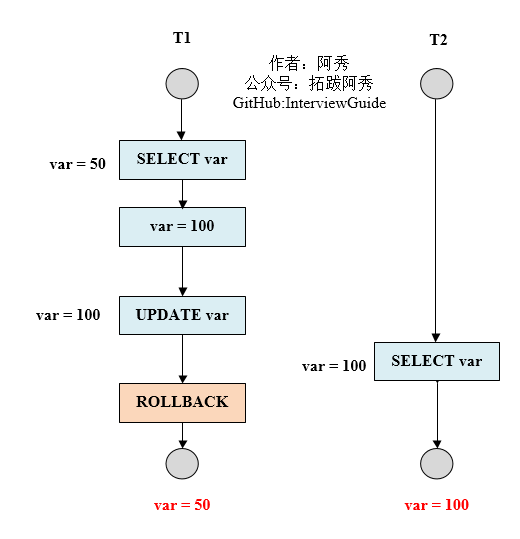
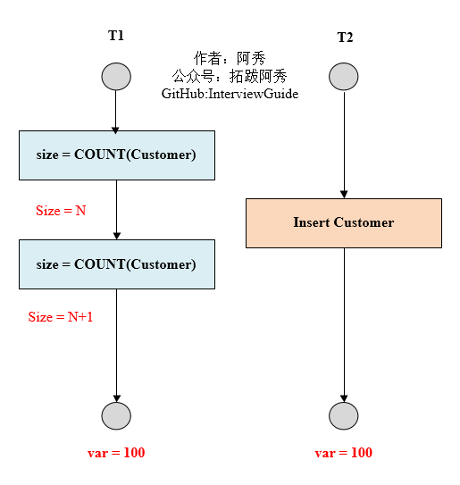
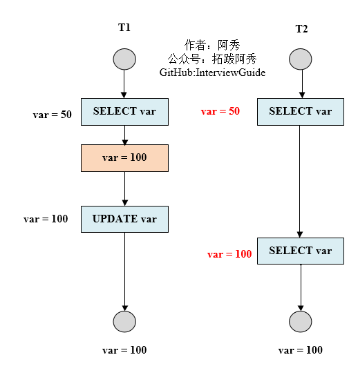
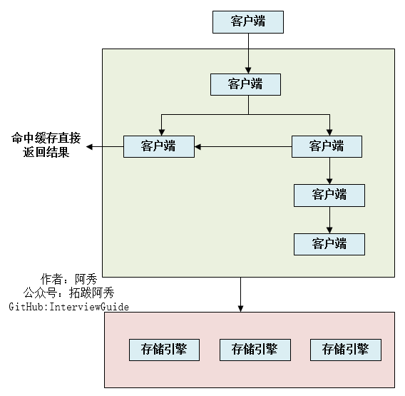

## 数据库隔离级别

- **未提交读**，事务中发生了修改，即使没有提交，其他事务也是可见的，比如对于一个数A原来50修改为100，但是我还没有提交修改，另一个事务看到这个修改，而这个时候原事务发生了回滚，这时候A还是50，但是另一个事务看到的A是100.**可能会导致脏读、幻读或不可重复读**
- **提交读**，对于一个事务从开始直到提交之前，所做的任何修改是其他事务不可见的，举例就是对于一个数A原来是50，然后提交修改成100，这个时候另一个事务在A提交修改之前，读取的A是50，刚读取完，A就被修改成100，这个时候另一个事务再进行读取发现A就突然变成100了；**可以阻止脏读，但是幻读或不可重复读仍有可能发生**
- **重复读**，就是对一个记录读取多次的记录是相同的，比如对于一个数A读取的话一直是A，前后两次读取的A是一致的；**可以阻止脏读和不可重复读，但幻读仍有可能发生**
- **可串行化读**，在并发情况下，和串行化的读取的结果是一致的，没有什么不同，比如不会发生脏读和幻读；**该级别可以防止脏读、不可重复读以及幻读**

| 隔离级别                  | 脏读 | 不可重复读 | 幻影读 |
| :------------------------ | :--- | :--------- | :----- |
| READ-UNCOMMITTED 未提交读 | √    | √          | √      |
| READ-COMMITTED 提交读     | ×    | √          | √      |
| REPEATABLE-READ 重复读    | ×    | ×          | √      |
| SERIALIZABLE 可串行化读   | ×    | ×          | ×      |

MySQL InnoDB 存储引擎的默认支持的隔离级别是 **REPEATABLE-READ**（可重读）

## MySQL 事务

- **原子性：**一个事务（transaction）中的所有操作，要么全部完成，要么全部不完成，不会结束在中间某个环节。事务在执行过程中发生错误，会被回滚（Rollback）到事务开始前的状态，就像这个事务从来没有执行过一样。
- **一致性：**在事务开始之前和事务结束以后，数据库的完整性没有被破坏。这表示写入的资料必须完全符合所有的预设规则，这包含资料的精确度、串联性以及后续数据库可以自发性地完成预定的工作。
- **隔离性：**数据库允许多个并发事务同时对其数据进行读写和修改的能力，隔离性可以防止多个事务并发执行时由于交叉执行而导致数据的不一致。事务隔离分为不同级别，包括读未提交（Read uncommitted）、读提交（read committed）、可重复读（repeatable read）和串行化（Serializable）。
- **持久性：**事务处理结束后，对数据的修改就是永久的，即便系统故障也不会丢失。

### 数据库并发事务会带来哪些问题？

数据库并发会带来脏读、幻读、丢弃更改、不可重复读这四个常见问题，其中：

**脏读**：在第一个修改事务和读取事务进行的时候，读取事务读到的数据为100，这是修改之后的数据，但是之后该事务满足一致性等特性而做了回滚操作，那么读取事务得到的结果就是脏数据了。

**幻读**：一般是T1在某个范围内进行修改操作（增加或者删除），而T2读取该范围导致读到的数据是修改之间的了，强调范围。

**丢弃修改**：两个写事务T1 T2同时对A=0进行递增操作，结果T2覆盖T1，导致最终结果是1 而不是2，事务被覆盖

**不可重复读**：T2 读取一个数据，然后T1 对该数据做了修改。如果 T2 再次读取这个数据，此时读取的结果和第一次读取的结果不同。

###### 脏读

​                                                                                                                      脏读

第一个事务首先读取var变量为50，接着准备更新为100的时，并未提交，第二个事务已经读取var为100，此时第一个事务做了回滚。最终第二个事务读取的var和数据库的var不一样。

**幻读(幻影读)**

​                                                                                                   幻读

T1 读取某个范围的数据，T2 在这个范围内插入新的数据，T1 再次读取这个范围的数据，此时读取的结果和和第一次读取的结果不同。

**丢弃修改**

T1 和 T2 两个事务都对一个数据进行修改，T1 先修改，T2 随后修改，T2 的修改覆盖了 T1 的修改。例如：事务1读取某表中的数据A=50，事务2也读取A=50，事务1修改A=A+50，事务2也修改A=A+50，最终结果A=100，事务1的修改被丢失。

**不可重复读**

T2 读取一个数据，T1 对该数据做了修改。如果 T2 再次读取这个数据，此时读取的结果和第一次读取的结果不同。

## MySQL优化:从哪些方面可以做到性能优化？

- 为搜索字段创建索引
- 避免使用 Select *，列出需要查询的字段
- 垂直分割分表
- 选择正确的存储引擎

## MyISAM和InnoDB实现B树索引方式的区别是什么？

- MyISAM，B+Tree叶节点的data域存放的是数据记录的地址，在索引检索的时候，首先按照B+Tree搜索算法搜索索引，如果指定的key存在，则取出其data域的值，然后以data域的值为地址读取相应的数据记录，这被称为“非聚簇索引”

- InnoDB，其数据文件本身就是索引文件，相比MyISAM，索引文件和数据文件是分离的，其表数据文件本身就是按B+Tree组织的一个索引结构，树的节点data域保存了完整的数据记录，这个索引的key是数据表的主键，因此InnoDB表数据文件本身就是主索引，这被称为“聚簇索引”或者聚集索引，而其余的索引都作为辅助索引，辅助索引的data域存储相应记录主键的值而不是地址，这也是和MyISAM不同的地方。

  在根据主索引搜索时，直接找到key所在的节点即可取出数据；在根据辅助索引查找时，则需要先取出主键的值，再走一遍主索引。因此，在设计表的时候，不建议使用过长的字段为主键，也不建议使用非单调的字段作为主键，这样会造成主索引频繁分裂。

## 说一下MySQL是如何执行一条SQL的？具体步骤有哪些？

​                                                                                                                   **SQL执行的全部过程**

Server层按顺序执行sql的步骤为：

1. 客户端请求->
2. 连接器（验证用户身份，给予权限） ->
3. 查询缓存（存在缓存则直接返回，不存在则执行后续操作）->
4. 分析器（对SQL进行词法分析和语法分析操作） ->
5. 优化器（主要对执行的sql优化选择最优的执行方案方法） ->
6. 执行器（执行时会先看用户是否有执行权限，有才去使用这个引擎提供的接口）->
7. 去引擎层获取数据返回（如果开启查询缓存则会缓存查询结果）

简单概括：

- **连接器**：管理连接、权限验证；
- **查询缓存**：命中缓存则直接返回结果；
- **分析器**：对SQL进行词法分析、语法分析；（判断查询的SQL字段是否存在也是在这步）
- **优化器**：执行计划生成、选择索引；
- **执行器**：操作引擎、返回结果；
- **存储引擎**：存储数据、提供读写接口。