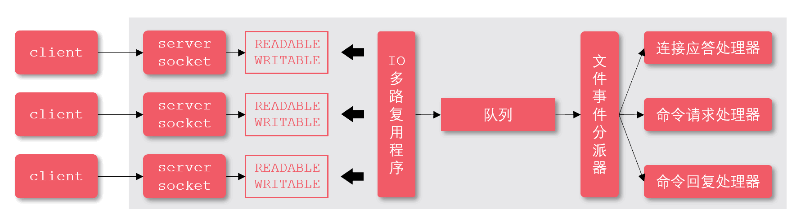
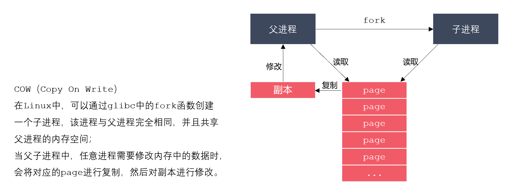
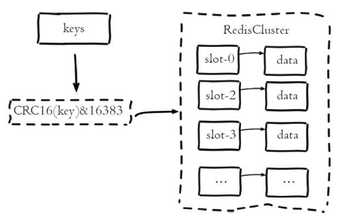
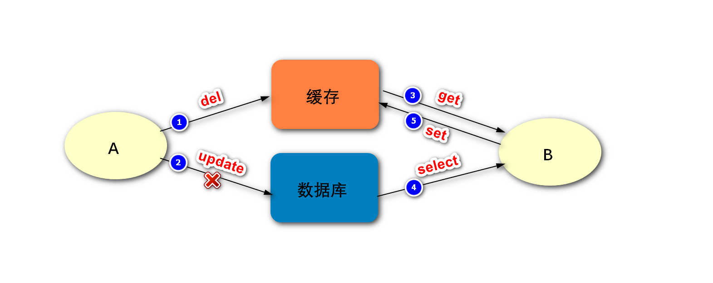
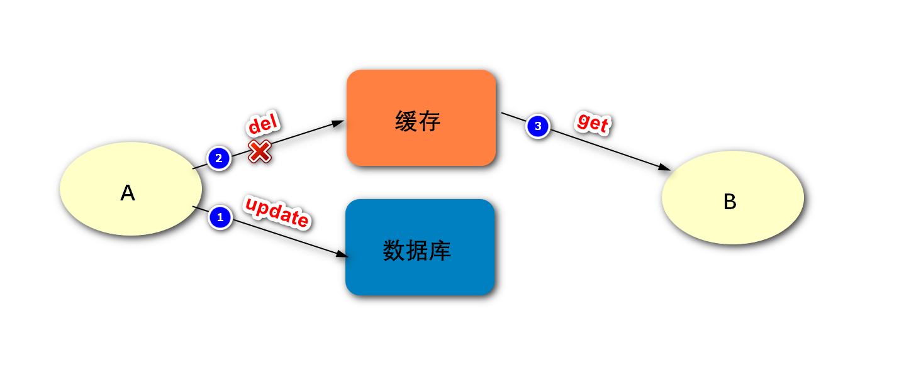
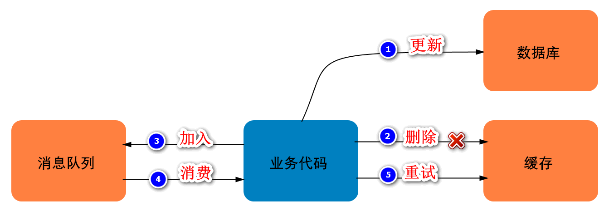
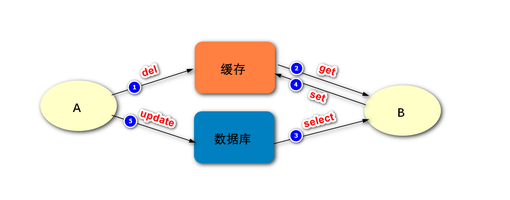
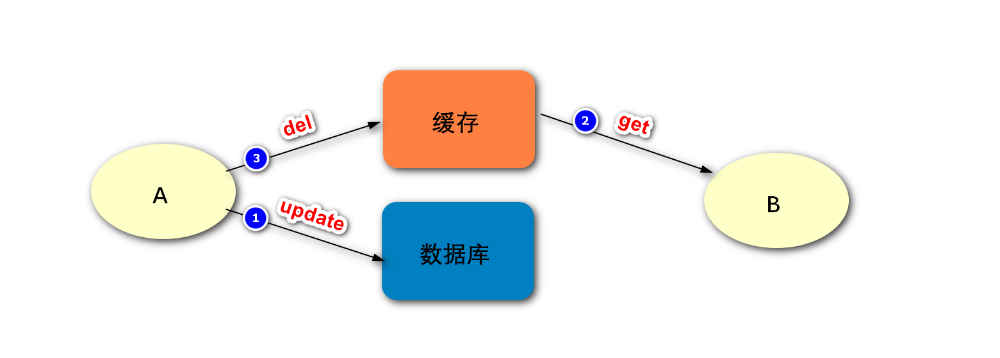
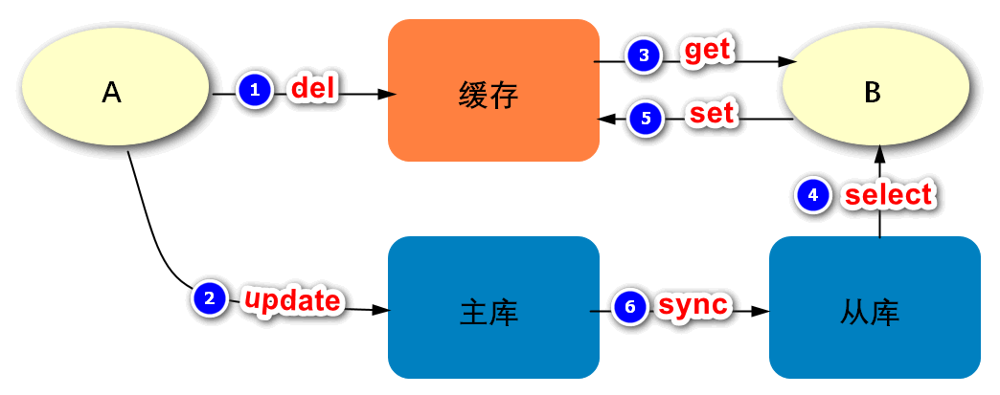

# Redis可以用来做什么？

1. Redis最常用来做缓存，是实现分布式缓存的首先中间件；
2. Redis可以作为数据库，实现诸如点赞、关注、排行等对性能要求极高的互联网需求；
3. Redis可以作为计算工具，能用很小的代价，统计诸如PV/UV、用户在线天数等数据；
4. Redis还有很多其他的使用场景，例如：可以实现分布式锁，可以作为消息队列使用。


# Redis和传统的关系型数据库有什么不同？

Redis是一种基于键值对的NoSQL数据库，而键值对的值是由多种数据结构和算法组成的。Redis的数据都存储于内存中，因此它的速度惊人，读写性能可达10万/秒，远超关系型数据库。

关系型数据库是基于二维数据表来存储数据的，它的数据格式更为严谨，并支持关系查询。关系型数据库的数据存储于磁盘上，可以存放海量的数据，但性能远不如Redis。


# Redis有哪些数据类型？

1. Redis支持5种核心的数据类型，分别是字符串、哈希、列表、集合、有序集合；
2. Redis还提供了Bitmap、HyperLogLog、Geo类型，但这些类型都是基于上述核心数据类型实现的；
3. Redis在5.0新增加了Streams数据类型，它是一个功能强大的、支持多播的、可持久化的消息队列。


# Redis是单线程的，为什么还能这么快？

1. 对服务端程序来说，线程切换和锁通常是性能杀手，而单线程避免了线程切换和竞争所产生的消耗；
2. Redis的大部分操作是在内存上完成的，这是它实现高性能的一个重要原因；
3. Redis采用了IO多路复用机制，使其在网络IO操作中能并发处理大量的客户端请求，实现高吞吐率。

关于Redis的单线程架构实现，如下图：




# Redis在持久化时fork出一个子进程，这时已经有两个进程了，怎么能说是单线程呢？

Redis是单线程的，主要是指Redis的网络IO和键值对读写是由一个线程来完成的。而Redis的其他功能，如持久化、异步删除、集群数据同步等，则是依赖其他线程来执行的。所以，说Redis是单线程的只是一种习惯的说法，事实上它的底层不是单线程的。


# set和zset有什么区别？

set：

- 集合中的元素是无序、不可重复的，一个集合最多能存储232-1个元素；
- 集合除了支持对元素的增删改查之外，还支持对多个集合取交集、并集、差集。

zset：

- 有序集合保留了集合元素不能重复的特点；
- 有序集合会给每个元素设置一个分数，并以此作为排序的依据；
- 有序集合不能包含相同的元素，但是不同元素的分数可以相同。


# 说一下Redis中的watch命令

很多时候，要确保事务中的数据没有被其他客户端修改才执行该事务。Redis提供了watch命令来解决这类问题，这是一种乐观锁的机制。客户端通过watch命令，要求服务器对一个或多个key进行监视，如果在客户端执行事务之前，这些key发生了变化，则服务器将拒绝执行客户端提交的事务，并向它返回一个空值。


# 说说Redis中List结构的相关操作

列表是线性有序的数据结构，它内部的元素是可以重复的，并且一个列表最多能存储2^32-1个元素。列表包含如下的常用命令：

- lpush/rpush：从列表的左侧/右侧添加数据；
- lrange：指定索引范围，并返回这个范围内的数据；
- lindex：返回指定索引处的数据；
- lpop/rpop：从列表的左侧/右侧弹出一个数据；
- blpop/brpop：从列表的左侧/右侧弹出一个数据，若列表为空则进入阻塞状态。


# 你要如何设计Redis的过期时间？

1. 热点数据不设置过期时间，使其达到“物理”上的永不过期，可以避免缓存击穿问题；
2. 在设置过期时间时，可以附加一个随机数，避免大量的key同时过期，导致缓存雪崩。


# Redis中，sexnx命令的返回值是什么，如何使用该命令实现分布式锁？

setnx命令返回整数值，当返回1时表示设置值成功，当返回0时表示设置值失败（key已存在）。

一般我们不建议直接使用setnx命令来实现分布式锁，因为为了避免出现死锁，我们要给锁设置一个自动过期时间。而setnx命令和设置过期时间的命令不是原子的，可能加锁成果而设置过期时间失败，依然存在死锁的隐患。对于这种情况，Redis改进了set命令，给它增加了nx选项，启用该选项时set命令的效果就会setnx一样了。

采用Redis实现分布式锁，就是在Redis里存一份代表锁的数据，通常用字符串即可。采用改进后的setnx命令（即set...nx...命令）实现分布式锁的思路，以及优化的过程如下：

加锁：

第一版，这种方式的缺点是容易产生死锁，因为客户端有可能忘记解锁，或者解锁失败。

```
setnx key value
```

第二版，给锁增加了过期时间，避免出现死锁。但这两个命令不是原子的，第二步可能会失败，依然无法避免死锁问题。

```
setnx key value expire key seconds
```

第三版，通过“set...nx...”命令，将加锁、过期命令编排到一起，它们是原子操作了，可以避免死锁。

```
set key value nx ex seconds 
```

解锁：

解锁就是删除代表锁的那份数据。

```
del key
```

问题：

看起来已经很完美了，但实际上还有隐患，如下图。进程A在任务没有执行完毕时，锁已经到期被释放了。等进程A的任务执行结束后，它依然会尝试释放锁，因为它的代码逻辑就是任务结束后释放锁。但是，它的锁早已自动释放过了，它此时释放的可能是其他线程的锁。


想要解决这个问题，我们需要解决两件事情：

1. 在加锁时就要给锁设置一个标识，进程要记住这个标识。当进程解锁的时候，要进行判断，是自己持有的锁才能释放，否则不能释放。可以为key赋一个随机值，来充当进程的标识。
2. 解锁时要先判断、再释放，这两步需要保证原子性，否则第二步失败的话，就会出现死锁。而获取和删除命令不是原子的，这就需要采用Lua脚本，通过Lua脚本将两个命令编排在一起，而整个Lua脚本的执行是原子的。

按照以上思路，优化后的命令如下：

```
# 加锁 set key random-value nx ex seconds   
# 解锁 if redis.call("get",KEYS[1]) == ARGV[1] then     
return redis.call("del",KEYS[1]) else     
return 0 end
```


# 说一说Redis的持久化策略

Redis支持RDB持久化、AOF持久化、RDB-AOF混合持久化这三种持久化方式。

RDB：

RDB(Redis Database)是Redis默认采用的持久化方式，它以快照的形式将进程数据持久化到硬盘中。RDB会创建一个经过压缩的二进制文件，文件以“.rdb”结尾，内部存储了各个数据库的键值对数据等信息。RDB持久化的触发方式有两种：

- 手动触发：通过SAVE或BGSAVE命令触发RDB持久化操作，创建“.rdb”文件；
- 自动触发：通过配置选项，让服务器在满足指定条件时自动执行BGSAVE命令。

其中，SAVE命令执行期间，Redis服务器将阻塞，直到“.rdb”文件创建完毕为止。而BGSAVE命令是异步版本的SAVE命令，它会使用Redis服务器进程的子进程，创建“.rdb”文件。BGSAVE命令在创建子进程时会存在短暂的阻塞，之后服务器便可以继续处理其他客户端的请求。总之，BGSAVE命令是针对SAVE阻塞问题做的优化，Redis内部所有涉及RDB的操作都采用BGSAVE的方式，而SAVE命令已经废弃！

BGSAVE命令的执行流程，如下图：


BGSAVE命令的原理，如下图：



RDB持久化的优缺点如下：

- 优点：RDB生成紧凑压缩的二进制文件，体积小，使用该文件恢复数据的速度非常快；

- 缺点：BGSAVE每次运行都要执行fork操作创建子进程，属于重量级操作，不宜频繁执行，

  所以RDB持久化没办法做到实时的持久化。

AOF：

AOF（Append Only File），解决了数据持久化的实时性，是目前Redis持久化的主流方式。AOF以独立日志的方式，记录了每次写入命令，重启时再重新执行AOF文件中的命令来恢复数据。AOF的工作流程包括：命令写入（append）、文件同步（sync）、文件重写（rewrite）、重启加载（load），如下图：


AOF默认不开启，需要修改配置项来启用它：

```
appendonly yes         # 启用AOF appendfilename "appendonly.aof"  # 设置文件名
```

AOF以文本协议格式写入命令，如：

```
*3\r\n$3\r\nset\r\n$5\r\nhello\r\n$5\r\nworld\r\n
```

文本协议格式具有如下的优点：

1. 文本协议具有很好的兼容性；
2. 直接采用文本协议格式，可以避免二次处理的开销；
3. 文本协议具有可读性，方便直接修改和处理。

AOF持久化的文件同步机制：

为了提高程序的写入性能，现代操作系统会把针对硬盘的多次写操作优化为一次写操作。

1. 当程序调用write对文件写入时，系统不会直接把数据写入硬盘，而是先将数据写入内存的缓冲区中；
2. 当达到特定的时间周期或缓冲区写满时，系统才会执行flush操作，将缓冲区中的数据冲洗至硬盘中；

这种优化机制虽然提高了性能，但也给程序的写入操作带来了不确定性。

1. 对于AOF这样的持久化功能来说，冲洗机制将直接影响AOF持久化的安全性；
2. 为了消除上述机制的不确定性，Redis向用户提供了appendfsync选项，来控制系统冲洗AOF的频率；
3. Linux的glibc提供了fsync函数，可以将指定文件强制从缓冲区刷到硬盘，上述选项正是基于此函数。

appendfsync选项的取值和含义如下：


AOF持久化的优缺点如下：

- 优点：与RDB持久化可能丢失大量的数据相比，AOF持久化的安全性要高很多。通过使用everysec选项，用户可以将数据丢失的时间窗口限制在1秒之内。
- 缺点：AOF文件存储的是协议文本，它的体积要比二进制格式的”.rdb”文件大很多。AOF需要通过执行AOF文件中的命令来恢复数据库，其恢复速度比RDB慢很多。AOF在进行重写时也需要创建子进程，在数据库体积较大时将占用大量资源，会导致服务器的短暂阻塞。

RDB-AOF混合持久化：

Redis从4.0开始引入RDB-AOF混合持久化模式，这种模式是基于AOF持久化构建而来的。用户可以通过配置文件中的“aof-use-rdb-preamble yes”配置项开启AOF混合持久化。Redis服务器在执行AOF重写操作时，会按照如下原则处理数据：

- 像执行BGSAVE命令一样，根据数据库当前的状态生成相应的RDB数据，并将其写入AOF文件中；
- 对于重写之后执行的Redis命令，则以协议文本的方式追加到AOF文件的末尾，即RDB数据之后。

通过使用RDB-AOF混合持久化，用户可以同时获得RDB持久化和AOF持久化的优点，服务器既可以通过AOF文件包含的RDB数据来实现快速的数据恢复操作，又可以通过AOF文件包含的AOF数据来将丢失数据的时间窗口限制在1s之内。


# 如何实现Redis的高可用

实现Redis的高可用，主要有哨兵和集群两种方式。

哨兵：

Redis Sentinel（哨兵）是一个分布式架构，它包含若干个哨兵节点和数据节点。每个哨兵节点会对数据节点和其余的哨兵节点进行监控，当发现节点不可达时，会对节点做下线标识。如果被标识的是主节点，它就会与其他的哨兵节点进行协商，当多数哨兵节点都认为主节点不可达时，它们便会选举出一个哨兵节点来完成自动故障转移的工作，同时还会将这个变化实时地通知给应用方。整个过程是自动的，不需要人工介入，有效地解决了Redis的高可用问题！

一组哨兵可以监控一个主节点，也可以同时监控多个主节点，两种情况的拓扑结构如下图：


哨兵节点包含如下的特征：

1. 哨兵节点会定期监控数据节点，其他哨兵节点是否可达；
2. 哨兵节点会将故障转移的结果通知给应用方；
3. 哨兵节点可以将从节点晋升为主节点，并维护后续正确的主从关系；
4. 哨兵模式下，客户端连接的是哨兵节点集合，从中获取主节点信息；
5. 节点的故障判断是由多个哨兵节点共同完成的，可有效地防止误判；
6. 哨兵节点集合是由多个哨兵节点组成的，即使个别哨兵节点不可用，整个集合依然是健壮的；
7. 哨兵节点也是独立的Redis节点，是特殊的Redis节点，它们不存储数据，只支持部分命令。

集群：

Redis集群采用虚拟槽分区来实现数据分片，它把所有的键根据哈希函数映射到0-16383整数槽内，计算公式为slot=CRC16(key)&16383，每一个节点负责维护一部分槽以及槽所映射的键值数据。虚拟槽分区具有如下特点：

1. 解耦数据和节点之间的关系，简化了节点扩容和收缩的难度；
2. 节点自身维护槽的映射关系，不需要客户端或者代理服务维护槽分区元数据；
3. 支持节点、槽、键之间的映射查询，用于数据路由，在线伸缩等场景。

Redis集群中数据的分片逻辑如下图：




## Redis的缓存淘汰策略

惰性删除、定期删除、maxmemory-policy；

- 惰性删除：客户端访问一个key的时候，Redis会先检查它的过期时间，如果发现过期就立刻删除这个key。
- 定期删除：redis会将设置了过期时间的key放到一个独立的字典中，并对该字典进行每秒10次的过期扫描，过期扫描不会遍历字典中所有的key，而是采用了一种简单的贪心策略，该策略如下：1、从过期字典红随机选择20个key,2、删除这20个key中已过期的key，3、如果已过期key的比例超过25%，则重复步骤1；
- 当写入数据将超出maxmemory限制时，Redis会采用maxmemory-policy所制定的策略进行数据淘汰 即 LRU （最近最少使用原则）LRU算法的不足之处在于,若一个key很少被访问,只是刚刚偶尔被访问了一次,则它就被认为是热点数据,短时间内不会被淘汰。 LFU算法正式用于解决上述问题,LFU（Least Frequently Used）是Redis4新增的淘汰策略,它根据key的最近访问频率进行淘汰。LFU在LRU的基础上,为每个数据增加了一个计数器,来统计这个数据的访问次数。当使用LFU策略淘汰数据时,首先会根据数据的访问次数进行筛选,把访问次数最低的数据淘汰出内存。如果两个数据的访问次数相同,LFU再比较这两个数据的访问时间,把访问时间更早的数据淘汰出内存。


# 缓存穿透、缓存击穿、缓存雪崩有什么区别，该如何解决？

## 缓存穿透：

问题描述：

客户端查询根本不存在的数据，使得请求直达存储层，导致其负载过大，甚至宕机。出现这种情况的原因，可能是业务层误将缓存和库中的数据删除了，也可能是有人恶意攻击，专门访问库中不存在的数据。

解决方案：

1. 缓存空对象：存储层未命中后，仍然将空值存入缓存层，客户端再次访问数据时，缓存层会直接返回空值。
2. 布隆过滤器：将数据存入布隆过滤器，访问缓存之前以过滤器拦截，若请求的数据不存在则直接返回空值。

## 缓存击穿：

问题描述：

一份热点数据，它的访问量非常大。在其缓存失效的瞬间，大量请求直达存储层，导致服务崩溃。

解决方案：

1. 永不过期：热点数据不设置过期时间，所以不会出现上述问题，这是“物理”上的永不过期。或者为每个数据设置逻辑过期时间，当发现该数据逻辑过期时，使用单独的线程重建缓存。
2. 加互斥锁：对数据的访问加互斥锁，当一个线程访问该数据时，其他线程只能等待。这个线程访问过后，缓存中的数据将被重建，届时其他线程就可以直接从缓存中取值。

## 缓存雪崩：

问题描述：

在某一时刻，缓存层无法继续提供服务，导致所有的请求直达存储层，造成数据库宕机。可能是缓存中有大量数据同时过期，也可能是Redis节点发生故障，导致大量请求无法得到处理。

解决方案：

1. 避免数据同时过期：设置过期时间时，附加一个随机数，避免大量的key同时过期。
2. 启用降级和熔断措施：在发生雪崩时，若应用访问的不是核心数据，则直接返回预定义信息/空值/错误信息。或者在发生雪崩时，对于访问缓存接口的请求，客户端并不会把请求发给Redis，而是直接返回。
3. 构建高可用的Redis服务：采用哨兵或集群模式，部署多个Redis实例，个别节点宕机，依然可以保持服务的整体可用。

# 如何保证缓存与数据库的双写一致性？

四种同步策略：

想要保证缓存与数据库的双写一致，一共有4种方式，即4种同步策略：

1. 先更新缓存，再更新数据库；
2. 先更新数据库，再更新缓存；
3. 先删除缓存，再更新数据库；
4. 先更新数据库，再删除缓存。

从这4种同步策略中，我们需要作出比较的是：

1. 更新缓存与删除缓存哪种方式更合适？
2. 应该先操作数据库还是先操作缓存？

更新缓存还是删除缓存：

下面，我们来分析一下，应该采用更新缓存还是删除缓存的方式。

- 更新缓存

  优点：每次数据变化都及时更新缓存，所以查询时不容易出现未命中的情况。

  缺点：更新缓存的消耗比较大。如果数据需要经过复杂的计算再写入缓存，那么频繁的更新缓存，就会影响服务器的性能。如果是写入数据频繁的业务场景，那么可能频繁的更新缓存时，却没有业务读取该数据。

- 删除缓存

  优点：操作简单，无论更新操作是否复杂，都是将缓存中的数据直接删除。

  缺点：删除缓存后，下一次查询缓存会出现未命中，这时需要重新读取一次数据库。

从上面的比较来看，一般情况下，删除缓存是更优的方案。

先操作数据库还是缓存：

下面，我们再来分析一下，应该先操作数据库还是先操作缓存。

首先，我们将先删除缓存与先更新数据库，在出现失败时进行一个对比：



如上图，是先删除缓存再更新数据库，在出现失败时可能出现的问题：

1. 进程A删除缓存成功；
2. 进程A更新数据库失败；
3. 进程B从缓存中读取数据；
4. 由于缓存被删，进程B无法从缓存中得到数据，进而从数据库读取数据；
5. 进程B从数据库成功获取数据，然后将数据更新到了缓存。

最终，缓存和数据库的数据是一致的，但仍然是旧的数据。而我们的期望是二者数据一致，并且是新的数据。



如上图，是先更新数据库再删除缓存，在出现失败时可能出现的问题：

1. 进程A更新数据库成功；
2. 进程A删除缓存失败；
3. 进程B读取缓存成功，由于缓存删除失败，所以进程B读取到的是旧的数据。

最终，缓存和数据库的数据是不一致的。

经过上面的比较，我们发现在出现失败的时候，是无法明确分辨出先删缓存和先更新数据库哪个方式更好，以为它们都存在问题。后面我们会进一步对这两种方式进行比较，但是在这里我们先探讨一下，上述场景出现的问题，应该如何解决呢？

实际上，无论上面我们采用哪种方式去同步缓存与数据库，在第二步出现失败的时候，都建议采用重试机制解决，因为最终我们是要解决掉这个错误的。而为了避免重试机制影响主要业务的执行，一般建议重试机制采用异步的方式执行，如下图：



这里我们按照先更新数据库，再删除缓存的方式，来说明重试机制的主要步骤：

1. 更新数据库成功；
2. 删除缓存失败；
3. 将此数据加入消息队列；
4. 业务代码消费这条消息；
5. 业务代码根据这条消息的内容，发起重试机制，即从缓存中删除这条记录。

好了，下面我们再将先删缓存与先更新数据库，在没有出现失败时进行对比：



如上图，是先删除缓存再更新数据库，在没有出现失败时可能出现的问题：

1. 进程A删除缓存成功；
2. 进程B读取缓存失败；
3. 进程B读取数据库成功，得到旧的数据；
4. 进程B将旧的数据成功地更新到了缓存；
5. 进程A将新的数据成功地更新到数据库。

可见，进程A的两步操作均成功，但由于存在并发，在这两步之间，进程B访问了缓存。最终结果是，缓存中存储了旧的数据，而数据库中存储了新的数据，二者数据不一致。



如上图，是先更新数据库再删除缓存，再没有出现失败时可能出现的问题：

1. 进程A更新数据库成功；
2. 进程B读取缓存成功；
3. 进程A更新数据库成功。

可见，最终缓存与数据库的数据是一致的，并且都是最新的数据。但进程B在这个过程里读到了旧的数据，可能还有其他进程也像进程B一样，在这两步之间读到了缓存中旧的数据，但因为这两步的执行速度会比较快，所以影响不大。对于这两步之后，其他进程再读取缓存数据的时候，就不会出现类似于进程B的问题了。

最终结论：

经过对比你会发现，先更新数据库、再删除缓存是影响更小的方案。如果第二步出现失败的情况，则可以采用重试机制解决问题。

**扩展阅读**

延时双删

上面我们提到，如果是先删缓存、再更新数据库，在没有出现失败时可能会导致数据的不一致。如果在实际的应用中，出于某些考虑我们需要选择这种方式，那有办法解决这个问题吗？答案是有的，那就是采用延时双删的策略，延时双删的基本思路如下：

1. 删除缓存；
2. 更新数据库；
3. sleep N毫秒；
4. 再次删除缓存。

阻塞一段时间之后，再次删除缓存，就可以把这个过程中缓存中不一致的数据删除掉。而具体的时间，要评估你这项业务的大致时间，按照这个时间来设定即可。

采用读写分离的架构怎么办？

如果数据库采用的是读写分离的架构，那么又会出现新的问题，如下图：



进程A先删除缓存，再更新主数据库，然后主库将数据同步到从库。而在主从数据库同步之前，可能会有进程B访问了缓存，发现数据不存在，进而它去访问从库获取到旧的数据，然后同步到缓存。这样，最终也会导致缓存与数据库的数据不一致。这个问题的解决方案，依然是采用延时双删的策略，但是在评估延长时间的时候，要考虑到主从数据库同步的时间。

第二次删除失败了怎么办？

如果第二次删除依然失败，则可以增加重试的次数，但是这个次数要有限制，当超出一定的次数时，要采取报错、记日志、发邮件提醒等措施。