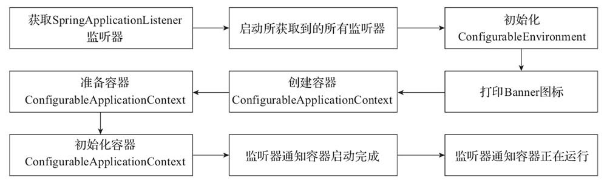

# **什么是 Spring Boot？**

Spring Boot 是 Spring 开源组织下的子项目，是 Spring 组件一站式解决方案，主要是简化了使用 Spring 的难度，简省了繁重的配置，提供了各种启动器，开发者能快速上手。

Spring Boot本身并不提供Spring的核心功能，而是作为Spring的脚手架框架，以达到快速构建项目、预置三方配置、开箱即用的目的。Spring Boot有如下的优点：

- 可以快速构建项目；
- 可以对主流开发框架的无配置集成；
- 项目可独立运行，无需外部依赖Servlet容器；
- 提供运行时的应用监控；
- 可以极大地提高开发、部署效率；
- 可以与云计算天然集成。

# **Spring Boot 的核心注解是哪个？它主要由哪几个注解组成的？**

启动类上面的注解是@SpringBootApplication，它也是 Spring Boot 的核心注解，主要组合包含了以下 3 个注解：              

@SpringBootConfiguration：组合了 @Configuration 注解，实现配置文件的功能。

@EnableAutoConfiguration：打开自动配置的功能，也可以关闭某个自动配置的选项，如关闭数据源自动配置功能：@SpringBootApplication(exclude = { DataSourceAutoConfiguration.class })。

@ComponentScan：Spring组件扫描。


# Spring Boot Starter有什么用？

**参考答案**

Spring Boot通过提供众多起步依赖（Starter）降低项目依赖的复杂度。起步依赖本质上是一个Maven项目对象模型（Project Object Model, POM），定义了对其他库的传递依赖，这些东西加在一起即支持某项功能。很多起步依赖的命名都暗示了它们提供的某种或某类功能。

举例来说，你打算把这个阅读列表应用程序做成一个Web应用程序。与其向项目的构建文件里添加一堆单独的库依赖，还不如声明这是一个Web应用程序来得简单。你只要添加Spring Boot的Web起步依赖就好了。


# 介绍Spring Boot的启动流程

首先，Spring Boot项目创建完成会默认生成一个名为 *Application 的入口类，我们是通过该类的main方法启动Spring Boot项目的。在main方法中，通过SpringApplication的静态方法，即run方法进行SpringApplication类的实例化操作，然后再针对实例化对象调用另外一个run方法来完成整个项目的初始化和启动。

SpringApplication调用的run方法的大致流程，如下图：



其中，SpringApplication在run方法中重点做了以下操作：

- 获取监听器和参数配置；
- 打印Banner信息；
- 创建并初始化容器；
- 监听器发送通知。

当然，除了上述核心操作，run方法运行过程中还涉及启动时长统计、异常报告、启动日志、异常处理等辅助操作。比较完整的流程，可以参考如下源代码：

```
public ConfigurableApplicationContext run(String... args) {     // 创建StopWatch对象，用于统计run方法启动时长。     StopWatch stopWatch = new StopWatc
```


# 什么是 JavaConfig？

Spring JavaConfig 是 Spring 社区的产品，它提供了配置 Spring IoC 容器的纯Java 方法。因此它有助于避免使用 XML 配置。使用 JavaConfig 的优点在于：

（1）面向对象的配置。由于配置被定义为 JavaConfig 中的类，因此用户可以充分利用 Java 中的面向对象功能。一个配置类可以继承另一个，重写它的@Bean 方法等。

（2）减少或消除 XML 配置。基于依赖注入原则的外化配置的好处已被证明。但是，许多开发人员不希望在 XML 和 Java 之间来回切换。JavaConfig 为开发人员提供了一种纯 Java 方法来配置与 XML 配置概念相似的 Spring 容器。从技术角度来讲，只使用 JavaConfig 配置类来配置容器是可行的，但实际上很多人认为将JavaConfig 与 XML 混合匹配是理想的。

（3）类型安全和重构友好。JavaConfig 提供了一种类型安全的方法来配置 Spring容器。由于 Java 5.0 对泛型的支持，现在可以按类型而不是按名称检索 bean，不需要任何强制转换或基于字符串的查找。

# 你如何理解 Spring Boot 配置加载顺序？

在 Spring Boot 里面，可以使用以下几种方式来加载配置。

1）properties文件；

2）YAML文件；

3）系统环境变量；

4）命令行参数；

# 说说你对Spring Boot注解的了解

@SpringBootApplication注解：

在Spring Boot入口类中，唯一的一个注解就是@SpringBootApplication。它是Spring Boot项目的核心注解，用于开启自动配置，准确说是通过该注解内组合的@EnableAutoConfiguration开启了自动配置。

@EnableAutoConfiguration注解：

@EnableAutoConfiguration的主要功能是启动Spring应用程序上下文时进行自动配置，它会尝试猜测并配置项目可能需要的Bean。自动配置通常是基于项目classpath中引入的类和已定义的Bean来实现的。在此过程中，被自动配置的组件来自项目自身和项目依赖的jar包中。

@Import注解：

@EnableAutoConfiguration的关键功能是通过@Import注解导入的ImportSelector来完成的。从源代码得知@Import(AutoConfigurationImportSelector.class)是@EnableAutoConfiguration注解的组成部分，也是自动配置功能的核心实现者。
