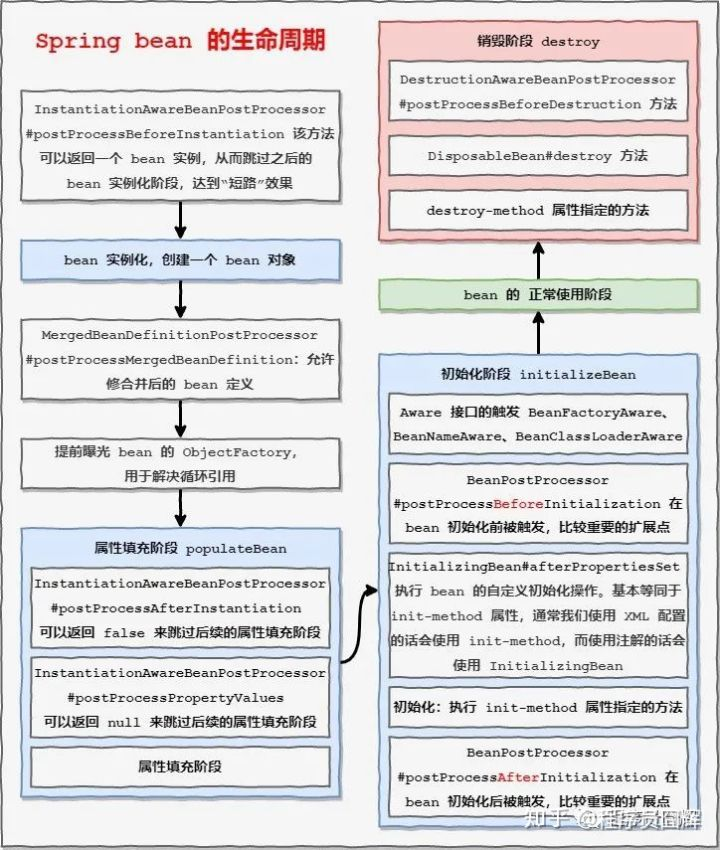

# 对Spring IOC的理解

IoC（Inversion of Control）是控制反转的意思，这是一种面向对象编程的设计思想。在不采用这种思想的情况下，我们需要自己维护对象与对象之间的依赖关系，很容易造成对象之间的耦合度过高，在一个大型的项目中这十分的不利于代码的维护。IoC则可以解决这种问题，它可以帮我们维护对象与对象之间的依赖关系，降低对象之间的耦合度。

说到IoC就不得不说DI（Dependency Injection），DI是依赖注入的意思，它是IoC实现的实现方式，就是说IoC是通过DI来实现的。由于IoC这个词汇比较抽象而DI却更直观，所以很多时候我们就用DI来代替它，在很多时候我们简单地将IoC和DI划等号，这是一种习惯。而实现依赖注入的关键是IoC容器，它的本质就是一个工厂。

在具体的实现中，主要由三种注入方式：

1. 构造方法注入

   就是被注入对象可以在它的构造方法中声明依赖对象的参数列表，让外部知道它需要哪些依赖对象。然后，IoC Service Provider会检查被注入的对象的构造方法，取得它所需要的依赖对象列表，进而为其注入相应的对象。构造方法注入方式比较直观，对象被构造完成后，即进入就绪状态，可以马上使用。

2. setter方法注入

   通过setter方法，可以更改相应的对象属性。所以，当前对象只要为其依赖对象所对应的属性添加setter方法，就可以通过setter方法将相应的依赖对象设置到被注入对象中。setter方法注入虽不像构造方法注入那样，让对象构造完成后即可使用，但相对来说更宽松一些， 可以在对象构造完成后再注入。

3. 接口注入

   相对于前两种注入方式来说，接口注入没有那么简单明了。被注入对象如果想要IoC Service Provider为其注入依赖对象，就必须实现某个接口。这个接口提供一个方法，用来为其注入依赖对象。IoC Service Provider最终通过这些接口来了解应该为被注入对象注入什么依赖对象。相对于前两种依赖注入方式，接口注入比较死板和烦琐。

总体来说，构造方法注入和setter方法注入因为其侵入性较弱，且易于理解和使用，所以是现在使用最多的注入方式。而接口注入因为侵入性较强，近年来已经不流行了。

# 对Spring AOP的理解

AOP（Aspect Oriented Programming）是面向切面编程，它是一种编程思想，是面向对象编程（OOP）的一种补充。面向对象编程将程序抽象成各个层次的对象，而面向切面编程是将程序抽象成各个切面。所谓切面，相当于应用对象间的横切点，我们可以将其单独抽象为单独的模块。

AOP的术语：

- 连接点（join point）：对应的是具体被拦截的对象，因为Spring只能支持方法，所以被拦截的对象往往就是指特定的方法，AOP将通过动态代理技术把它织入对应的流程中。
- 切点（point cut）：有时候，我们的切面不单单应用于单个方法，也可能是多个类的不同方法，这时，可以通过正则式和指示器的规则去定义，从而适配连接点。切点就是提供这样一个功能的概念。
- 通知（advice）：就是按照约定的流程下的方法，分为前置通知、后置通知、环绕通知、事后返回通知和异常通知，它会根据约定织入流程中。
- 目标对象（target）：即被代理对象。
- 引入（introduction）：是指引入新的类和其方法，增强现有Bean的功能。
- 织入（weaving）：它是一个通过动态代理技术，为原有服务对象生成代理对象，然后将与切点定义匹配的连接点拦截，并按约定将各类通知织入约定流程的过程。
- 切面（aspect）：是一个可以定义切点、各类通知和引入的内容，SpringAOP将通过它的信息来增强Bean的功能或者将对应的方法织入流程。

Spring AOP：

AOP可以有多种实现方式，而Spring AOP支持如下两种实现方式。

- JDK动态代理：这是Java提供的动态代理技术，可以在运行时创建接口的代理实例。Spring AOP默认采用这种方式，在接口的代理实例中织入代码。
- CGLib动态代理：采用底层的字节码技术，在运行时创建子类代理的实例。当目标对象不存在接口时，Spring AOP就会采用这种方式，在子类实例中织入代码。

## AOP的应用场景

Spring AOP为IoC的使用提供了更多的便利，一方面，应用可以直接使用AOP的功能，设计应用的横切关注点，把跨越应用程序多个模块的功能抽象出来，并通过简单的AOP的使用，灵活地编制到模块中，比如可以通过AOP实现应用程序中的日志功能。另一方面，在Spring内部，一些支持模块也是通过Spring AOP来实现的，比如事务处理。从这两个角度就已经可以看到Spring AOP的核心地位了。

# Spring Beans

## 什么是Spring beans？

Spring beans 是那些形成Spring应用的主干的java对象。它们被Spring IOC容器初始化，装配，和管理。这些beans通过容器中配置的元数据创建。比如，以XML文件中 的形式定义。

## 如何给Spring 容器提供配置元数据？Spring有几种配置方式

这里有三种重要的方法给Spring 容器提供配置元数据。

- XML配置文件。
- 基于注解的配置。
- 基于java的配置。

## Spring基于xml注入bean的几种方式

1. Set方法注入；
2. 构造器注入：①通过index设置参数的位置；②通过type设置参数类型；
3. 静态工厂注入；
4. 实例工厂；

## Spring框架中的单例bean是线程安全的吗？

不是，Spring框架中的单例bean不是线程安全的。

spring 中的 bean 默认是单例模式，spring 框架并没有对单例 bean 进行多线程的封装处理。

实际上大部分时候 spring bean 无状态的（比如 dao 类），所有某种程度上来说 bean 也是安全的，但如果 bean 有状态的话（比如 view model 对象），那就要开发者自己去保证线程安全了，最简单的就是改变 bean 的作用域，把“singleton”变更为“prototype”，这样请求 bean 相当于 new Bean()了，所以就可以保证线程安全了。

有状态就是有数据存储功能。
无状态就是不会保存数据。

## Spring bean 的生命周期 *

Bean 生命周期大致分为 Bean 定义、Bean 的初始化、Bean的生存期和 Bean 的销毁4个部分（创建、初始化、调用、销毁）。具体步骤如下 ：

1. Spring启动,查找并加载需要被Spring管理的bean,进行Bean的实例化 
2. Bean实例化后对将Bean的引入和值注入到Bean的属性中 
3. 如果Bean实现了BeanNameAware接口的话,Spring将Bean的Id传递给setBeanName()方法 
4. 如果Bean实现了BeanFactoryAware接口的话,Spring将调用setBeanFactory()方法,将BeanFactory容器实例传入 
5. 如果Bean实现了ApplicationContextAware接口的话,Spring将调用Bean的setApplicationContext()方法,将bean所在应用上下文引用传入进来。 
6. 如果Bean实现了BeanPostProcessor接口,Spring就将调用他们的postProcessBeforeInitialization()方法。
7. 如果Bean 实现了InitializingBean接口,Spring将调用他们的afterPropertiesSet()方法。类似的,如果bean使用init-method声明了初始化方法,该方法也会被调用。
8. 如果Bean 实现了BeanPostProcessor接口,Spring就将调用他们的postProcessAfterInitialization()方法。 
9. 此时,Bean已经准备就绪,可以被应用程序使用了。他们将一直驻留在应用上下文中,直到应用上下文被销毁。 
10.  如果bean实现了DisposableBean接口,Spring将调用它的destory()接口方法,同样,如果bean使用了destory-method 声明销毁方法,该方法也会被调用。 

​    

加分回答 这个过程是由Spring容器自动管理的,其中有两个环节我们可以进行干预。 1. 我们可以自定义初始化方法,并在该方法前增加@PostConstruct注解,届时Spring容器将在调用SetBeanFactory方法之后调用该方法。 2. 我们可以自定义销毁方法,并在该方法前增加@PreDestroy注解,届时Spring容器将在自身销毁前,调用这个方法。

## 解释Spring支持的几种bean的作用域

Spring框架支持以下五种bean的作用域：

**singleton :** bean在每个Spring ioc 容器中只有一个实例。

**prototype：**一个bean的定义可以有多个实例。

**request：**每次http请求都会创建一个bean，该作用域仅在基于web的Spring ApplicationContext情形下有效。

**session：**在一个HTTP Session中，一个bean定义对应一个实例。该作用域仅在基于web的Spring ApplicationContext情形下有效。

**global-session：**在一个全局的HTTP Session中，一个bean定义对应一个实例。该作用域仅在基于web的Spring ApplicationContext情形下有效。

**注意：** 缺省的Spring bean 的作用域是Singleton。使用 prototype 作用域需要慎重的思考，因为频繁创建和销毁 bean 会带来很大的性能开销。

## BeanFactory和FactoryBean的区别

**BeanFactory：**Spring 容器最核心也是最基础的接口，本质是个工厂类，用于管理 bean 的工厂，最核心的功能是加载 bean，也就是 getBean 方法，通常我们不会直接使用该接口，而是使用其子接口。

**FactoryBean：**该接口以 bean 样式定义，但是它不是一种普通的 bean，它是个工厂 bean，实现该接口的类可以自己定义要创建的 bean 实例，只需要实现它的 getObject 方法即可。

FactoryBean 被广泛应用于 Java 相关的中间件中，如果你看过一些中间件的源码，一定会看到 FactoryBean 的身影。

一般来说，都是通过 FactoryBean#getObject 来返回一个代理类，当我们触发调用时，会走到代理类中，从而可以在代理类中实现中间件的自定义逻辑，比如：RPC 最核心的几个功能，选址、建立连接、远程调用，还有一些自定义的监控、限流等等。

## Spring 怎么解决循环依赖的问题 *

Spring 是通过提前暴露 bean 的引用来解决的，具体如下。

Spring 首先使用构造函数创建一个 “不完整” 的 bean 实例（之所以说不完整，是因为此时该 bean 实例还未初始化），并且提前曝光该 bean 实例的 ObjectFactory（提前曝光就是将 ObjectFactory 放到 singletonFactories 缓存）.

通过 ObjectFactory 我们可以拿到该 bean 实例的引用，如果出现循环引用，我们可以通过缓存中的 ObjectFactory 来拿到 bean 实例，从而避免出现循环引用导致的死循环。

举个例子：A 依赖了 B，B 也依赖了 A，那么依赖注入过程如下。

- 检查 A 是否在缓存中，发现不存在，进行实例化
- 通过构造函数创建 bean A，并通过 ObjectFactory 提前曝光 bean A
- A 走到属性填充阶段，发现依赖了 B，所以开始实例化 B。
- 首先检查 B 是否在缓存中，发现不存在，进行实例化
- 通过构造函数创建 bean B，并通过 ObjectFactory 曝光创建的 bean B
- B 走到属性填充阶段，发现依赖了 A，所以开始实例化 A。
- 检查 A 是否在缓存中，发现存在，拿到 A 对应的 ObjectFactory 来获得 bean A，并返回。
- B 继续接下来的流程，直至创建完毕，然后返回 A 的创建流程，A 同样继续接下来的流程，直至创建完毕。

这边通过缓存中的 ObjectFactory 拿到的 bean 实例虽然拿到的是 “不完整” 的 bean 实例，但是由于是单例，所以后续初始化完成后，该 bean 实例的引用地址并不会变，所以最终我们看到的还是完整 bean 实例。

## Spring 三级缓存

Spring 的三级缓存其实就是解决循环依赖时所用到的三个缓存。

singletonObjects：正常情况下的 bean 被创建完毕后会被放到该缓存，key：beanName，value：bean 实例。

singletonFactories：上面说的提前曝光的 ObjectFactory 就会被放到该缓存中，key：beanName，value：ObjectFactory。

earlySingletonObjects：该缓存用于存放 ObjectFactory 返回的 bean，也就是说对于一个 bean，ObjectFactory 只会被用一次，之后就通过

earlySingletonObjects 来获取，key：beanName，早期 bean 实例。

# Spring注解

## @Autowired和@Resource注解有什么区别？

1. @Autowired是Spring提供的注解，@Resource是JDK提供的注解。
2. @Autowired是只能按类型注入，@Resource默认按名称注入，也支持按类型注入。
3. @Autowired按类型装配依赖对象，默认情况下它要求依赖对象必须存在，如果允许null值，可以设置它required属性为false，如果我们想使用按名称装配，可以结合@Qualifier注解一起使用。@Resource有两个中重要的属性：name和type。name属性指定byName，如果没有指定name属性，当注解标注在字段上，即默认取字段的名称作为bean名称寻找依赖对象，当注解标注在属性的setter方法上，即默认取属性名作为bean名称寻找依赖对象。需要注意的是，@Resource如果没有指定name属性，并且按照默认的名称仍然找不到依赖对象时， @Resource注解会回退到按类型装配。但一旦指定了name属性，就只能按名称装配了。

## @Component, @Controller, @Repository, @Service 有何区别？

@Component：这将 java 类标记为 bean。它是任何 Spring 管理组件的通用构造型。spring 的组件扫描机制现在可以将其拾取并将其拉入应用程序环境中。

@Controller：这将一个类标记为 Spring Web MVC 控制器。标有它的 Bean 会自动导入到 IoC 容器中。

@Service：此注解是组件注解的特化。它不会对 @Component 注解提供任何其他行为。您可以在服务层类中使用 @Service 而不是 @Component，因为它以更好的方式指定了意图。

@Repository：这个注解是具有类似用途和功能的 @Component 注解的特化。它为 DAO 提供了额外的好处。它将 DAO 导入 IoC 容器，并使未经检查的异常有资格转换为 Spring DataAccessException。

## @RequestMapping 注解有什么用？

@RequestMapping 注解用于将特定 HTTP 请求方法映射到将处理相应请求的控制器中的特定类/方法。此注释可应用于两个级别：

- 类级别：映射请求的 URL
- 方法级别：映射 URL 以及 HTTP 请求方法

# Spring数据访问

## 说一下Spring的事务传播行为

spring事务的传播行为说的是，当多个事务同时存在的时候，spring如何处理这些事务的行为。

① PROPAGATION_REQUIRED：如果当前没有事务，就创建一个新事务，如果当前存在事务，就加入该事务，该设置是最常用的设置。

② PROPAGATION_SUPPORTS：支持当前事务，如果当前存在事务，就加入该事务，如果当前不存在事务，就以非事务执行。

③ PROPAGATION_MANDATORY：支持当前事务，如果当前存在事务，就加入该事务，如果当前不存在事务，就抛出异常。

④ PROPAGATION_REQUIRES_NEW：创建新事务，无论当前存不存在事务，都创建新事务。

⑤ PROPAGATION_NOT_SUPPORTED：以非事务方式执行操作，如果当前存在事务，就把当前事务挂起。

⑥ PROPAGATION_NEVER：以非事务方式执行，如果当前存在事务，则抛出异常。

⑦ PROPAGATION_NESTED：如果当前存在事务，则在嵌套事务内执行。如果当前没有事务，则按REQUIRED属性执行。

## 说一下 spring 的事务隔离？

spring 有五大隔离级别，默认值为 ISOLATION_DEFAULT（使用数据库的设置），其他四个隔离级别和数据库的隔离级别一致：

ISOLATION_DEFAULT：用底层数据库的设置隔离级别，数据库设置的是什么我就用什么；

ISOLATION_READ_UNCOMMITTED：未提交读，最低隔离级别、事务未提交前，就可被其他事务读取（会出现脏读、幻读、不可重复读）；

ISOLATION_READ_COMMITTED：提交读，一个事务提交后才能被其他事务读取到（会造成幻读、不可重复读），SQL server 的默认级别；

ISOLATION_REPEATABLE_READ：可重复读，保证多次读取同一个数据时，其值都和事务开始时候的内容是一致，禁止读取到别的事务未提交的数据（会造成幻读），MySQL 的默认级别；

ISOLATION_SERIALIZABLE：序列化，代价最高最可靠的隔离级别，该隔离级别能防止脏读、不可重复读、幻读。

脏读 ：表示一个事务能够读取另一个事务中还未提交的数据。比如，某个事务尝试插入记录 A，此时该事务还未提交，然后另一个事务尝试读取到了记录 A。

不可重复读 ：是指在一个事务内，多次读同一数据。

幻读 ：指同一个事务内多次查询返回的结果集不一样。比如同一个事务 A 第一次查询时候有 n 条记录，但是第二次同等条件下查询却有 n+1 条记录，这就好像产生了幻觉。发生幻读的原因也是另外一个事务新增或者删除或者修改了第一个事务结果集里面的数据，同一个记录的数据内容被修改了，所有数据行的记录就变多或者变少了。

# Spring面向切面编程(AOP)

## 什么是AOP

AOP(Aspect-Oriented Programming)，一般称为面向切面编程，作为面向对象的一种补充，用于将那些与业务无关，但却对多个对象产生影响的公共行为和逻辑，抽取并封装为一个可重用的模块，这个模块被命名为“切面”（Aspect），减少系统中的重复代码，降低了模块间的耦合度，同时提高了系统的可维护性。可用于权限认证、日志、事务处理等。

## Spring 的 AOP 有哪几种创建代理的方式

Spring 中的 AOP 目前支持 JDK 动态代理和 Cglib 代理。

通常来说：如果被代理对象实现了接口，则使用 JDK 动态代理，否则使用 Cglib 代理。另外，也可以通过指定 proxyTargetClass=true 来实现强制走 Cglib 代理。

## JDK 动态代理和 Cglib 代理的区别

1、JDK 动态代理本质上是实现了被代理对象的接口，而 Cglib 本质上是继承了被代理对象，覆盖其中的方法。

2、JDK 动态代理只能对实现了接口的类生成代理，Cglib 则没有这个限制。但是 Cglib 因为使用继承实现，所以 Cglib 无法代理被 final 修饰的方法或类。

3、在调用代理方法上，JDK 是通过反射机制调用，Cglib是通过FastClass 机制直接调用。FastClass 简单的理解，就是使用 index 作为入参，可以直接定位到要调用的方法直接进行调用。

4、在性能上，JDK1.7 之前，由于使用了 FastClass 机制，Cglib 在执行效率上比 JDK 快，但是随着 JDK 动态代理的不断优化，从 JDK 1.7 开始，JDK 动态代理已经明显比 Cglib 更快了。

## Spring AOP里面的几个名词

（1）切面（Aspect）：切面是通知和切点的结合。通知和切点共同定义了切面的全部内容。 在Spring AOP中，切面可以使用通用类（基于模式的风格） 或者在普通类中以 @AspectJ 注解来实现。

（2）连接点（Join point）：指方法，在Spring AOP中，一个连接点 总是 代表一个方法的执行。 应用可能有数以千计的时机应用通知。这些时机被称为连接点。连接点是在应用执行过程中能够插入切面的一个点。这个点可以是调用方法时、抛出异常时、甚至修改一个字段时。切面代码可以利用这些点插入到应用的正常流程之中，并添加新的行为。

（3）通知（Advice）：在AOP术语中，切面的工作被称为通知。

（4）切入点（Pointcut）：切点的定义会匹配通知所要织入的一个或多个连接点。我们通常使用明确的类和方法名称，或是利用正则表达式定义所匹配的类和方法名称来指定这些切点。

（5）引入（Introduction）：引入允许我们向现有类添加新方法或属性。

（6）目标对象（Target Object）： 被一个或者多个切面（aspect）所通知（advise）的对象。它通常是一个代理对象。也有人把它叫做 被通知（adviced） 对象。 既然Spring AOP是通过运行时代理实现的，这个对象永远是一个 被代理（proxied） 对象。

（7）织入（Weaving）：织入是把切面应用到目标对象并创建新的代理对象的过程。在目标对象的生命周期里有多少个点可以进行织入：

编译期：切面在目标类编译时被织入。AspectJ的织入编译器是以这种方式织入切面的。
类加载期：切面在目标类加载到JVM时被织入。需要特殊的类加载器，它可以在目标类被引入应用之前增强该目标类的字节码。AspectJ5的加载时织入就支持以这种方式织入切面。
运行期：切面在应用运行的某个时刻被织入。一般情况下，在织入切面时，AOP容器会为目标对象动态地创建一个代理对象。SpringAOP就是以这种方式织入切面。

## Spring通知有哪些类型？

在AOP术语中，切面的工作被称为通知，实际上是程序执行时要通过SpringAOP框架触发的代码段。

Spring切面可以应用5种类型的通知：

前置通知（Before）：在目标方法被调用之前调用通知功能；
后置通知（After）：在目标方法完成之后调用通知，此时不会关心方法的输出是什么；
返回通知（After-returning ）：在目标方法成功执行之后调用通知；
异常通知（After-throwing）：在目标方法抛出异常后调用通知；
环绕通知（Around）：通知包裹了被通知的方法，在被通知的方法调用之前和调用之后执行自定义的行为。

**正常情况：**

**异常情况：**

