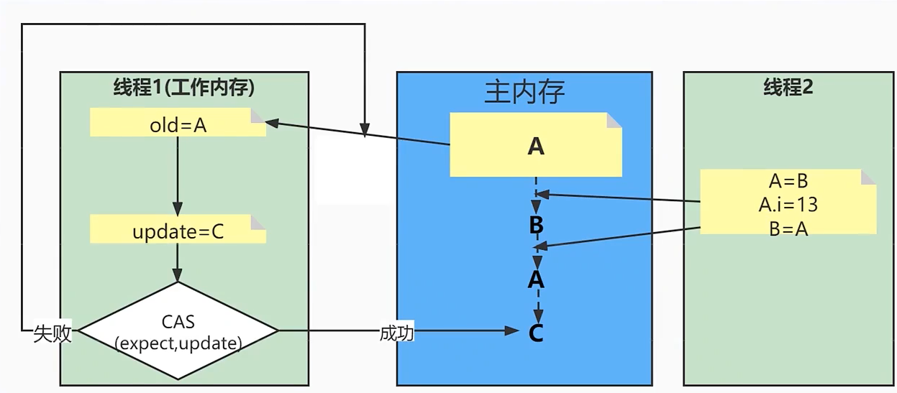

## CAS

CAS，全称为Compare and Swap，即比较-替换。假设有三个操作数：**内存值V、旧的预期值A、要修改的值B，当且仅当预期值A和内存值V相同时，才会将内存值修改为B并返回true，否则什么都不做并返回false**。当然CAS一定要volatile变量配合，这样才能保证每次拿到的变量是主内存中最新的那个值，否则旧的预期值A对某条线程来说，永远是一个不会变的值A，只要某次CAS操作失败，永远都不可能成功。

问题：会出现ABA问题

比如说，一个线程1从内存位置V中取出A，这个时候另一个线程2也从内存中取出A，并且线程2进行了一些操作将值变成了B，然后线程2又将V位置的数据变成A，这个时候线程1进行CAS操作发现内存中仍然是A，然后线程1操作成功。

解决办法就是新增一种机制，那就是修改版本号，每进行一次修改就增加一次版本号，在最后对比一下版本号是否是线程初始读取的版本号，如果是则成功，否则自旋再次重复上述过程。

当并发过多时会出现CAS多次自旋，这时候就要加重量级锁

### volatile

（1）使用volatile关键字修饰的变量，保证了其在多线程之间的可见性，即每次读取到volatile变量，一定是最新的数据。

（2）禁止语义重排序

### synchronized