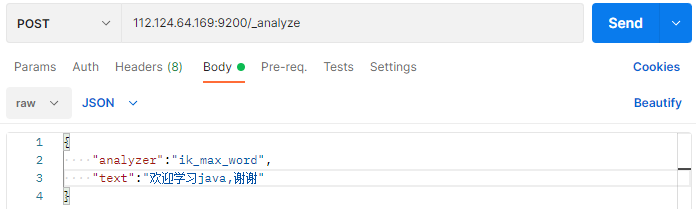
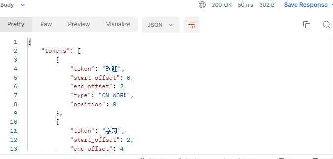
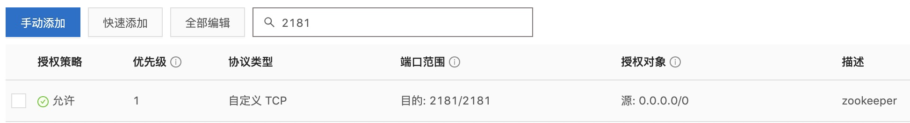
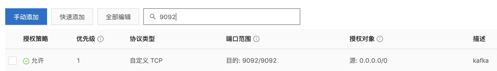
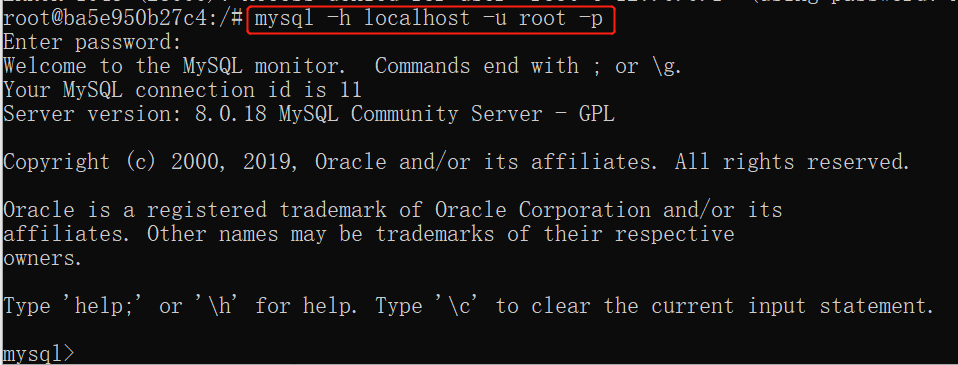

# 安装docker社区版

## 1.更新yum包至最新

```
yum -y update
```

## 2.卸载已经存在的旧版docker

```
yum remove docker \
                  docker-client \
                  docker-client-latest \
                  docker-common \
                  docker-latest \
                  docker-latest-logrotate \
                  docker-logrotate \
                  docker-engine
```

## 有可能返回下面的结果，这是OK的，说明你之前没有安装旧版的docker，直接进入3

```
No Match for argument: docker
No Match for argument: docker-client
No Match for argument: docker-client-latest
No Match for argument: docker-common
No Match for argument: docker-latest
No Match for argument: docker-latest-logrotate
No Match for argument: docker-logrotate
No Match for argument: docker-engine
No Packages marked for removal
```

## 3.安装docker社区版

```perl
# 添加阿里云docker镜像仓库
cd /etc/yum.repos.d && wget http://mirrors.aliyun.com/docker-ce/linux/centos/docker-ce.repo
# 更新yum配置
yum makecache fast
# 安装docker-ce
yum -y install docker-ce
# 验证安装是否成功(有client和service两部分表示docker安装启动都成功了)
docker version

Client: Docker Engine - Community
 Version:           19.03.5
 API version:       1.40
 Go version:        go1.12.12
 Git commit:        633a0ea
 Built:             Wed Nov 13 07:25:41 2019
 OS/Arch:           linux/amd64
 Experimental:      false

Server: Docker Engine - Community
 Engine:
  Version:          19.03.5
  API version:      1.40 (minimum version 1.12)
  Go version:       go1.12.12
  Git commit:       633a0ea
  Built:            Wed Nov 13 07:24:18 2019
  OS/Arch:          linux/amd64
  Experimental:     false
 containerd:
  Version:          1.2.10
  GitCommit:        b34a5c8af56e510852c35414db4c1f4fa6172339
 runc:
  Version:          1.0.0-rc8+dev
  GitCommit:        3e425f80a8c931f88e6d94a8c831b9d5aa481657
 docker-init:
  Version:          0.18.0
  GitCommit:        fec3683
```

## 4.启动docker 并设置开机启动

```bash
# 启动
systemctl start docker
# 添加开机启动 # 如果是个人使用最后不要设置开机自启
systemctl enable docker
```

## docker仓库加速

由于某些原因docker hub的速度感人，所以我们需要一个国内的仓库镜像，这里使用阿里云的镜像仓库

仓库列表：

1. [docker-cn](https://link.juejin.cn?target=https%3A%2F%2Fregistry.docker-cn.com)
2. [网易](https://link.juejin.cn?target=http%3A%2F%2Fhub-mirror.c.163.com)
3. [DaoCloud](https://link.juejin.cn?target=http%3A%2F%2Ff1361db2.m.daocloud.io)
4. [腾讯](https://link.juejin.cn?target=https%3A%2F%2Fmirror.ccs.tencentyun.com)
5. [阿里](https://link.juejin.cn?target=https%3A%2F%2F3laho3y3.mirror.aliyuncs.com)

```perl
# 修改配置文件
vim /usr/lib/systemd/system/docker.service
# 在dockerd后面加参数
ExecStart=/usr/bin/dockerd --registry-mirror=https://3laho3y3.mirror.aliyuncs.com/
# 重新加载配置
systemctl daemon-reload
# 重启docker
systemctl docker restart
```

# docker常用命令

## 有关于系统对docker的命令

| 命令                   | 描述           |
| ---------------------- | -------------- |
| systemctl start docker | 启动docker服务 |
| systemctl stop docker  | 停止docker服务 |

## 有关于镜像的命令

| 命令                      | 描述                                                         |
| ------------------------- | ------------------------------------------------------------ |
| docker search 镜像名      | 搜索镜像                                                     |
| docker pull 镜像名        | 下载镜像                                                     |
| docker images             | 列出镜像                                                     |
| docker rmi 镜像名或镜像id | 删除镜像                                                     |
| docker build -t xx/xxxx   | 打包镜像  # -t 表示指定镜像仓库名称/镜像名称:镜像标签 .表示使用当前目录下的Dockerfile文件 |

## Docker容器常用命令

| 命令                | 描述             |
| ------------------- | ---------------- |
| docker ps           | 列出运行中的容器 |
| docker ps -a        | 列出所有容器     |
| docker stop 容器id  | 停止容器         |
| docker start 容器id | 启动容器         |
| docker rm 容器id    | 删除指定容器     |
| ctrl p+q            | 退出容器         |

## 查看容器的日志

| 命令                             | 描述                                                  |
| -------------------------------- | ----------------------------------------------------- |
| docker logs 容器id               | 查看容器产生的全部日志                                |
| docker stats 容器id              | 查看指定容器资源占用状况，比如cpu、内存、网络、io状态 |
| docker stats -a                  | 查看所有容器资源占用情况                              |
| docker system df                 | 查看容器磁盘使用情况                                  |
| docker exec -it 容器id /bin/bash | 执行容器内部命令                                      |

# Docker安装ElasticSearch

##  拉取镜像

```shell
docker pull elasticsearch:7.4.0
```

##  创建容器

```shell
docker run -id --name elasticsearch -d --restart=always -p 9200:9200 -p 9300:9300 -v /usr/share/elasticsearch/plugins:/usr/share/elasticsearch/plugins -e "discovery.type=single-node" -e ES_JAVA_OPTS="-Xms200m -Xmx200m" elasticsearch:7.4.0
```

## 配置中文分词器 ik

因为在创建elasticsearch容器的时候，映射了目录，所以可以在宿主机上进行配置ik中文分词器

在去选择ik分词器的时候，需要与elasticsearch的版本好对应上

把资料中的`elasticsearch-analysis-ik-7.4.0.zip`上传到服务器上,放到对应目录（plugins）解压

```shell
#切换目录
cd /usr/share/elasticsearch/plugins
#新建目录
mkdir analysis-ik
cd analysis-ik
#root根目录中拷贝文件
mv elasticsearch-analysis-ik-7.4.0.zip /usr/share/elasticsearch/plugins/analysis-ik
#解压文件
cd /usr/share/elasticsearch/plugins/analysis-ik
unzip elasticsearch-analysis-ik-7.4.0.zip
#重启elasticsearch
docker restart 容器id
```

## 阿里云开放9200端口


## postman连接测试



返回以下为成功



# Docker安装kafka

## 1、安装zookeeper

1.1拉取镜像

```
docker pull wurstmeister/zookeeper
```

1.2 启动镜像

```
docker run -d --name zookeeper -p 2181:2181 -t wurstmeister/zookeeper
```

1.3 开通阿里云服务器2181端口



## 2、安装kakfa

2.1 拉取镜像

```
docker pull wurstmeister/kafka:2.12-2.3.1
```

2.2 启动镜像

```
docker run -d --name kafka \
--env KAFKA_ADVERTISED_HOST_NAME=112.124.64.169 \
--env KAFKA_ZOOKEEPER_CONNECT=112.124.64.169:2181 \
--env KAFKA_ADVERTISED_LISTENERS=PLAINTEXT://112.124.64.169:9092 \
--env KAFKA_LISTENERS=PLAINTEXT://0.0.0.0:9092 \
--env KAFKA_HEAP_OPTS="-Xmx256M -Xms256M" \
--net=host wurstmeister/kafka:2.12-2.3.1
```

 3.3 开通阿里云服务器9092端口



## 3、测试kafa是否安装成功

3.1 查看是否启动成功

```
[root@iZbp1ijdf1o5r3xv8jhvaeZ ~]# docker ps
CONTAINER ID   IMAGE                           COMMAND                  CREATED          STATUS          PORTS                                                           NAMES
d9a1f7ae45ba   wurstmeister/kafka:2.12-2.3.1   "start-kafka.sh"         8 seconds ago    Up 5 seconds    0.0.0.0:9092->9092/tcp, :::9092->9092/tcp                       kafka
e5df6a80f1a2   zookeeper:3.4.14                "/docker-entrypoint.…"   36 minutes ago   Up 36 minutes   2888/tcp, 0.0.0.0:2181->2181/tcp, :::2181->2181/tcp, 3888/tcp   zookeeper
73091c751397   minio/minio                     "/usr/bin/docker-ent…"   3 weeks ago      Up 3 weeks      0.0.0.0:9000-9001->9000-9001/tcp, :::9000-9001->9000-9001/tcp   minio
4f0c0bc6c1b5   nacos/nacos-server              "bin/docker-startup.…"   3 weeks ago      Up 3 weeks      0.0.0.0:8848->8848/tcp, :::8848->8848/tcp                       nacos
```

3.2  验证kafka是否可以使用

```
docker exec -it kafka /bin/bash
```

3.2.1 启动失败

​     如出现You have to remove (or rename) that container to be able to reuse that name.**使用docker ps 时查看发现没有运行，使用 docker ps -l 查看未启动成功的容器，使用docker rm 容器id删除未启动成功的容器**

3.2.2 启动成功

```
[root@iZbp1ijdf1o5r3xv8jhvaeZ ~]# docker exec -it kafka /bin/bash
root@d9a1f7ae45ba:/# 
```

# 安装MySQL

## 1、查看可用的 MySQL 版本

用 **docker search mysql** 命令来查看可用版本

## 2、拉取 MySQL 镜像

```
$ docker pull mysql:latest
```

## 3、查看本地镜像

使用以下命令来查看是否已安装了 mysql：

```
$ docker images
```

## 4、运行容器

安装完成后，我们可以使用以下命令来运行 mysql 容器：

```
$ docker run -itd --name mysql-test -p 3306:3306 -e MYSQL_ROOT_PASSWORD=123456 mysql
```

参数说明：

- **-p 3306:3306** ：映射容器服务的 3306 端口到宿主机的 3306 端口，外部主机可以直接通过 **宿主机ip:3306** 访问到 MySQL 的服务。
- **MYSQL_ROOT_PASSWORD=123456**：设置 MySQL 服务 root 用户的密码。

## 5、安装成功

通过 **docker ps** 命令查看是否安装成功：

本机可以通过 root 和密码 123456 访问 MySQL 服务。

[](https://www.runoob.com/wp-content/uploads/2016/06/docker-mysql7.png)

## 本地连接Docker中的MySQL

修改root 可以通过任何客户端连接

```sql
$  ALTER USER 'root'@'%' IDENTIFIED WITH mysql_native_password BY '123456';
```

# Docker安装Redis

## 拉取Redis镜像

```java
 docker pull redis
```

## 启动Redis指定密码

```
docker run -p 6379:6379 --name root \
-v /mydata/redis/data:/data \
-v /mydata/redis/redis.conf:/etc/redis/redis.conf \
-d redis redis-server --appendonly yes --requirepass "123456"
```

## 修改容器中Redis的密码

### 进入redis的容器

```bash
docker exec -it r /bin/bash
复制代码
```

### 运行命令：

```
redis-cli
```

### 查看现有的redis密码：

```arduino
127.0.0.1:6379> config get requirepass
1) "requirepass"
2) ""
```

### 设置redis密码：

```arduino
127.0.0.1:6379>config set requirepass ****（****为你要设置的密码）
OK
```

# Docker安装minio 

## Docker 搜索Minio镜像

```
docker search minio
```

## Docker 拉取Minio镜像

```
docker pull minio/minio
```

## Docker 启动Minio镜像

```
#最近更新的命令
docker run -d \
  -p 9000:9000 \
  -p 9001:9001 \
  --name minio \
  -v /home/minio/data:/data \
  -e "MINIO_ROOT_USER=minio" \
  -e "MINIO_ROOT_PASSWORD=minio1" \
  minio/minio server /data --console-address ":9001"
```

