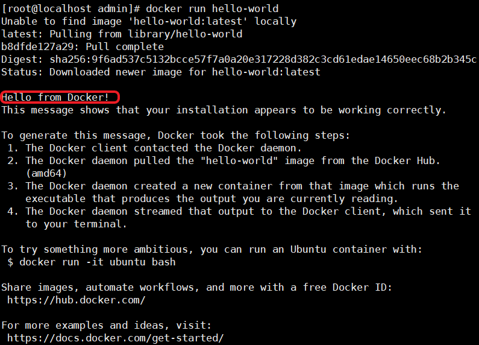
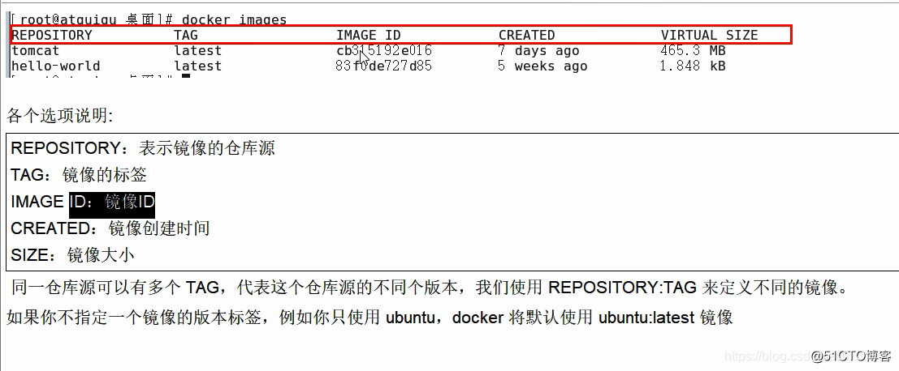
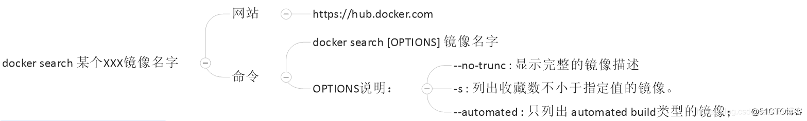
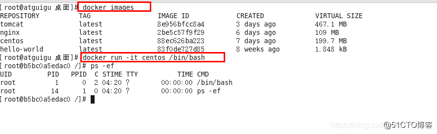
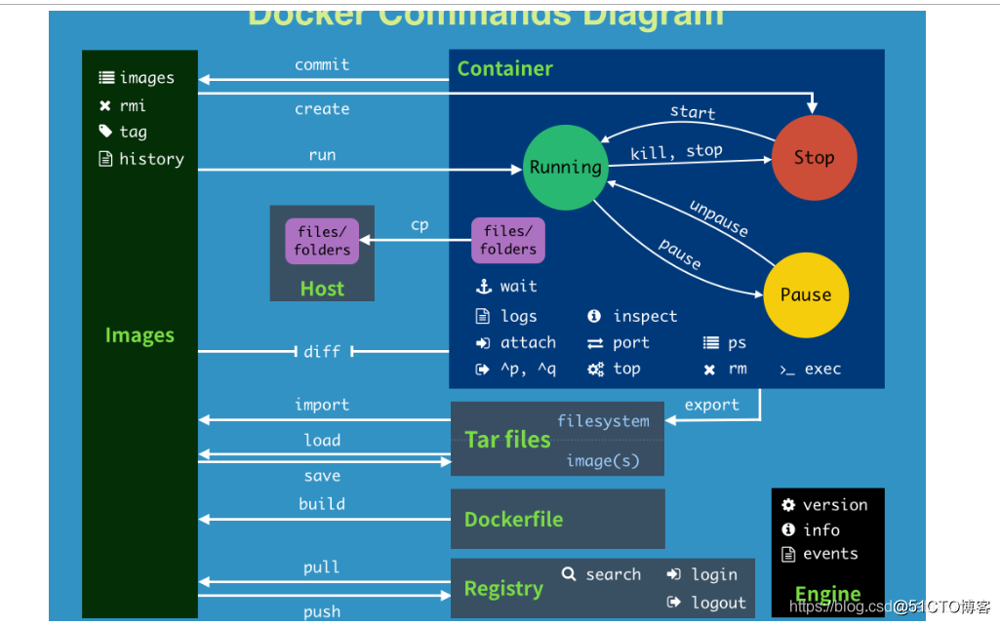

## 安装Docker

```java
#1、卸载旧版本，官方文档查找 https://docs.docker.com/
sudo yum remove docker \
                  docker-client \
                  docker-client-latest \
                  docker-common \
                  docker-latest \
                  docker-latest-logrotate \
                  docker-logrotate \
                  docker-engine
# 2、设置存储库
# 安装yum-utils包（提供yum-config-manager 实用程序）并设置稳定存储库。
sudo yum install -y yum-utils

3、#设置镜像的仓库，使用国内阿里云镜像
sudo yum-config-manager \
	--add-repo \
	http://mirrors.aliyun.com/docker-ce/linux/centos/docker-ce.repo
#更新yum软件包索引
yum makecache fast

4、#安装docker相关源 docker-ce 社区 ee 企业版
sudo yum install docker-ce docker-ce-cli containerd.io

5、#启动docker
systemctl start docker

6、#查看docker版本
docker version

7、#运行hello-world
```



没找到镜像，pulling向官方远程拉取镜像，签名信息表示已经拉取到

```java
8、#查看hello-world镜像
[root@localhost admin]# docker images
REPOSITORY    TAG       IMAGE ID       CREATED        SIZE
hello-world   latest    d1165f221234   3 months ago   13.3kB

9、#卸载依赖、删除资源
sudo yum remove docker-ce docker-ce-cli containerd.io
sudo rm -rf /var/lib/docker			#/var/lib/docker	docker默认工作路径
```

## docker常用命令

### 一、帮助命令

docker Version

docker info

docker --help
自己查看官网解释，高手都是自己练出来的，百度上只不过是翻译了下，加了点例子

```
docker Version

docker info

docker --help
自己查看官网解释，高手都是自己练出来的，百度上只不过是翻译了下，加了点例子
```


### 二、镜像命令

1、docker images 列出本机上的镜像



OPTIONS 说明：

-a 列出本地所有的镜像(含中间映射层)
-q 只显示镜像ID
--digests 显示镜像的摘要信息
--no-trunc 显示完整的镜像信息

```
-a 列出本地所有的镜像(含中间映射层)
-q 只显示镜像ID
--digests 显示镜像的摘要信息
--no-trunc 显示完整的镜像信息
```

2、docker search 某个XXX镜像的名字



3、docker pull 某个镜像的名字
 下载镜像

 docker pull 镜像名字[:TAG]


4、docker rmi 某个XXX镜像的名字ID
 删除镜像

 删除单个 docker rm -f 镜像ID

 删除多个 docker rm -f 镜像名1:TAG 镜像名2:TAG

 删除多个 docker rmi -f ${docker images -qa}

### 三、容器命令

有镜像才能创建容器，这是根本前提(下载一个Centos镜像演示)

```
docker pull centos
```

新建并启动容器
 docker run [OPTIONS] IMAGE [COMMAND][ARG]

 OPTIONS 说明

```
OPTIONS说明（常用）：有些是一个减号，有些是两个减号

--name="容器新名字": 为容器指定一个名称；
-d: 后台运行容器，并返回容器ID，也即启动守护式容器；
-i：以交互模式运行容器，通常与 -t 同时使用；
-t：为容器重新分配一个伪输入终端，通常与 -i 同时使用；
-P: 随机端口映射；
-p: 指定端口映射，有以下四种格式
      ip:hostPort:containerPort
      ip::containerPort
      hostPort:containerPort
      containerPort
```


启动交互式容器


```
#使用镜像centos:latest以交互模式启动一个容器,在容器内执行/bin/bash命令。
docker run -it centos /bin/bash 
```

列出当前所有正在运行的容器
 dockers ps [OPTIONS]

```
OPTIONS说明(常用) :
-a :列出当前所有正在运行的容器+历史上运行过的
-l :显示最近创建的容器。
-n：显示最近n个创建的容器。
-q :静默模式，只显示容器编号。
--no-trunc :不截断输出。

```

**退出容器**
两种退出方式

 exit 容器停止退出

 ctrl+P+Q 容器不停止退出

**启动容器**
docker start 容器ID或容器签名

**重启容器**
docker restart 容器ID或容器签名

**停止容器**
docker stop 容器ID或容器签名

**强制停止容器**
docker kill 容器ID或容器签名

**删除已停止的容器**
docker rm 容器ID -f

 **一次性删除多个容器**

 docker rm -f $(docker ps -a -q)

 docker ps -a -q | xargs docker rm

**重要**
启动守护式容器
#使用镜像centos:latest以后台模式启动一个容器
docker run -d centos

问题:然后docker ps -a进行查看,会发现容器已经退出
很重要的要说明的一点: Docker容器后台运行,就必须有一个前台进程.
容器运行的命令如果不是那些一直挂起的命令 (比如运行top，tail) ，就是会自动退出的。
这个是docker的机制问题,比如你的web容器，我们以nginx为例，正常情况下,我们配置启动服务只需要启动响应的service即可。例如
service nginx start
但是,这样做,nginx为后台进程模式运行,就导致docker前台没有运行的应用,这样的容器后台启动后，会立即自杀因为他觉得他没事可做了.所以，最佳的解决方案是将你要运行的程序以前台进程的形式运行

查看容器日志
docker logs -f -t --tail 容器ID

 -t 是加入时间戳

 -f 跟随最新的日志打印

 --tail 数字显示最后多少条

查看容器内的进程
docker top 容器ID

查看容器内部细节
docker inspect 容器ID

进入正在运行的容器并以命令行交互
docker exec -it 容器ID bashShell


重新进入docker attach 容器ID

上述两个区别

attach 直接进入容器启动命令的终端，不会启动新的进程

exec 实在容器中打开新的终端，并且可以穷的那个新的进程

从容器内拷贝文件到主机上
docker cp 容器ID:容器内路径 目的主机路径

### 四、小总结



```
attach    Attach to a running container                 # 当前 shell 下 attach 连接指定运行镜像
build     Build an image from a Dockerfile              # 通过 Dockerfile 定制镜像
commit    Create a new image from a container changes   # 提交当前容器为新的镜像
cp        Copy files/folders from the containers filesystem to the host path   #从容器中拷贝指定文件或者目录到宿主机中
create    Create a new container                        # 创建一个新的容器，同 run，但不启动容器
diff      Inspect changes on a container's filesystem   # 查看 docker 容器变化
events    Get real time events from the server          # 从 docker 服务获取容器实时事件
exec      Run a command in an existing container        # 在已存在的容器上运行命令
export    Stream the contents of a container as a tar archive   # 导出容器的内容流作为一个 tar 归档文件[对应 import ]
history   Show the history of an image                  # 展示一个镜像形成历史
images    List images                                   # 列出系统当前镜像
import    Create a new filesystem image from the contents of a tarball # 从tar包中的内容创建一个新的文件系统映像[对应export]
info      Display system-wide information               # 显示系统相关信息
inspect   Return low-level information on a container   # 查看容器详细信息
kill      Kill a running container                      # kill 指定 docker 容器
load      Load an image from a tar archive              # 从一个 tar 包中加载一个镜像[对应 save]
login     Register or Login to the docker registry server    # 注册或者登陆一个 docker 源服务器
logout    Log out from a Docker registry server          # 从当前 Docker registry 退出
logs      Fetch the logs of a container                 # 输出当前容器日志信息
port      Lookup the public-facing port which is NAT-ed to PRIVATE_PORT    # 查看映射端口对应的容器内部源端口
pause     Pause all processes within a container        # 暂停容器
ps        List containers                               # 列出容器列表
pull      Pull an image or a repository from the docker registry server   # 从docker镜像源服务器拉取指定镜像或者库镜像
push      Push an image or a repository to the docker registry server    # 推送指定镜像或者库镜像至docker源服务器
restart   Restart a running container                   # 重启运行的容器
rm        Remove one or more containers                 # 移除一个或者多个容器
rmi       Remove one or more images             # 移除一个或多个镜像[无容器使用该镜像才可删除，否则需删除相关容器才可继续或 -f 强制删除]
run       Run a command in a new container              # 创建一个新的容器并运行一个命令
save      Save an image to a tar archive                # 保存一个镜像为一个 tar 包[对应 load]
search    Search for an image on the Docker Hub         # 在 docker hub 中搜索镜像
start     Start a stopped containers                    # 启动容器
stop      Stop a running containers                     # 停止容器
tag       Tag an image into a repository                # 给源中镜像打标签
top       Lookup the running processes of a container   # 查看容器中运行的进程信息
unpause   Unpause a paused container                    # 取消暂停容器
version   Show the docker version information           # 查看 docker 版本号
wait      Block until a container stops, then print its exit code   # 截取容器停止时的退出状态值
```

## 在docker容器中安装新的工具

比如：

```
//先更新包管理工具
apt-get update
//然后安装我们需要的工具，以vim为例
apt-get install v
```

