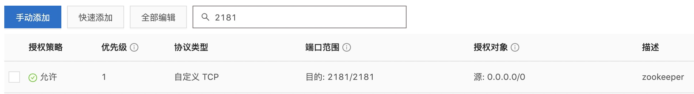
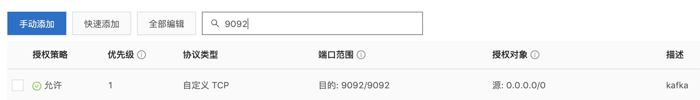

### 1、安装zookeeper

1.1拉取镜像

```
docker pull wurstmeister/zookeeper
```

1.2 启动镜像

```
docker run -d --name zookeeper -p 2181:2181 -t wurstmeister/zookeeper
```

1.3 开通阿里云服务器2181端口



### 2、安装kakfa

2.1 拉取镜像

```
docker pull wurstmeister/kafka
```

2.2 启动镜像

```
docker run  -d --name kafka \
   -p 9092:9092 \
   -e KAFKA_BROKER_ID=0 \
   -e KAFKA_ADVERTISED_HOST_NAME=112.124.64.169 \
   -e KAFKA_ZOOKEEPER_CONNECT=112.124.64.169:2181 \
   -e KAFKA_ADVERTISED_LISTENERS=PLAINTEXT://112.124.64.169:9092 \
   -e KAFKA_LISTENERS=PLAINTEXT://0.0.0.0:9092 -t wurstmeister/kafka:2.12-2.3.1
```

 3.3 开通阿里云服务器9092端口



### 3、测试kafa是否安装成功

3.1 查看是否启动成功

```
[root@iZbp1ijdf1o5r3xv8jhvaeZ ~]# docker ps
CONTAINER ID   IMAGE                           COMMAND                  CREATED          STATUS          PORTS                                                           NAMES
d9a1f7ae45ba   wurstmeister/kafka:2.12-2.3.1   "start-kafka.sh"         8 seconds ago    Up 5 seconds    0.0.0.0:9092->9092/tcp, :::9092->9092/tcp                       kafka
e5df6a80f1a2   zookeeper:3.4.14                "/docker-entrypoint.…"   36 minutes ago   Up 36 minutes   2888/tcp, 0.0.0.0:2181->2181/tcp, :::2181->2181/tcp, 3888/tcp   zookeeper
73091c751397   minio/minio                     "/usr/bin/docker-ent…"   3 weeks ago      Up 3 weeks      0.0.0.0:9000-9001->9000-9001/tcp, :::9000-9001->9000-9001/tcp   minio
4f0c0bc6c1b5   nacos/nacos-server              "bin/docker-startup.…"   3 weeks ago      Up 3 weeks      0.0.0.0:8848->8848/tcp, :::8848->8848/tcp                       nacos
```

3.2  验证kafka是否可以使用

```
docker exec -it kafka /bin/bash
```

3.2.1 启动失败

​     如出现You have to remove (or rename) that container to be able to reuse that name.**使用docker ps 时查看发现没有运行，使用 docker ps -l 查看未启动成功的容器，使用docker rm 容器id删除未启动成功的容器**

3.2.2 启动成功

```
[root@iZbp1ijdf1o5r3xv8jhvaeZ ~]# docker exec -it kafka /bin/bash
root@d9a1f7ae45ba:/# 
```