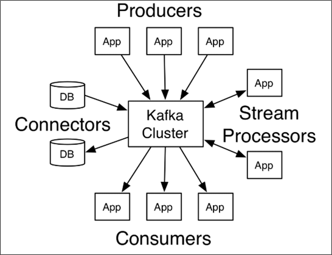
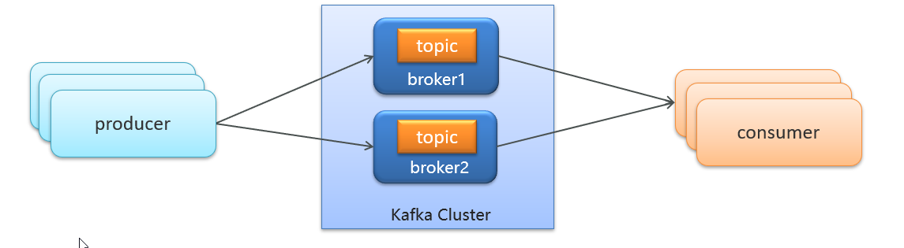
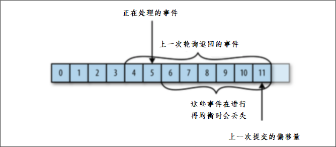

# kafka概述

Kafka 是一个分布式流媒体平台,类似于消息队列或企业消息传递系统。kafka官网：http://kafka.apache.org/  



kafka介绍-名词解释



- producer：发布消息的对象称之为主题生产者（Kafka topic producer）

- topic：Kafka将消息分门别类，每一类的消息称之为一个主题（Topic）

- consumer：订阅消息并处理发布的消息的对象称之为主题消费者（consumers）

- broker：已发布的消息保存在一组服务器中，称之为Kafka集群。集群中的每一个服务器都是一个代理（Broker）。 消费者可以订阅一个或多个主题（topic），并从Broker拉数据，从而消费这些已发布的消息。

# 安装kafka

参考docker端安装教程


# kafka入门


- 生产者发送消息，多个消费者只能有一个消费者接收到消息
- 生产者发送消息，多个消费者都可以接收到消息


（1）创建kafka-demo项目，导入依赖

```xml
<dependency>
    <groupId>org.apache.kafka</groupId>
    <artifactId>kafka-clients</artifactId>
</dependency>
```

（2）生产者发送消息

```java
package com.heima.kafka.sample;

import org.apache.kafka.clients.producer.KafkaProducer;
import org.apache.kafka.clients.producer.ProducerConfig;
import org.apache.kafka.clients.producer.ProducerRecord;

import java.util.Properties;

/**
 * 生产者
 */
public class ProducerQuickStart {

    public static void main(String[] args) {
        //1.kafka的配置信息
        Properties properties = new Properties();
        //kafka的连接地址
        properties.put(ProducerConfig.BOOTSTRAP_SERVERS_CONFIG,"192.168.200.130:9092");
        //发送失败，失败的重试次数
        properties.put(ProducerConfig.RETRIES_CONFIG,5);
        //消息key的序列化器
        properties.put(ProducerConfig.KEY_SERIALIZER_CLASS_CONFIG,"org.apache.kafka.common.serialization.StringSerializer");
        //消息value的序列化器
        properties.put(ProducerConfig.VALUE_SERIALIZER_CLASS_CONFIG,"org.apache.kafka.common.serialization.StringSerializer");

        //2.生产者对象
        KafkaProducer<String,String> producer = new KafkaProducer<String, String>(properties);

        //封装发送的消息
        ProducerRecord<String,String> record = new ProducerRecord<String, String>("itheima-topic","100001","hello kafka");

        //3.发送消息
        producer.send(record);

        //4.关闭消息通道，必须关闭，否则消息发送不成功
        producer.close();
    }

}
```


（3）消费者接收消息

```java
package com.heima.kafka.sample;

import org.apache.kafka.clients.consumer.ConsumerConfig;
import org.apache.kafka.clients.consumer.ConsumerRecord;
import org.apache.kafka.clients.consumer.ConsumerRecords;
import org.apache.kafka.clients.consumer.KafkaConsumer;

import java.time.Duration;
import java.util.Collections;
import java.util.Properties;

/**
 * 消费者
 */
public class ConsumerQuickStart {

    public static void main(String[] args) {
        //1.添加kafka的配置信息
        Properties properties = new Properties();
        //kafka的连接地址
        properties.put(ConsumerConfig.BOOTSTRAP_SERVERS_CONFIG, "192.168.200.130:9092");
        //消费者组
        properties.put(ConsumerConfig.GROUP_ID_CONFIG, "group2");
        //消息的反序列化器
        properties.put(ConsumerConfig.KEY_DESERIALIZER_CLASS_CONFIG, "org.apache.kafka.common.serialization.StringDeserializer");
        properties.put(ConsumerConfig.VALUE_DESERIALIZER_CLASS_CONFIG, "org.apache.kafka.common.serialization.StringDeserializer");

        //2.消费者对象
        KafkaConsumer<String, String> consumer = new KafkaConsumer<String, String>(properties);

        //3.订阅主题
        consumer.subscribe(Collections.singletonList("itheima-topic"));

        //当前线程一直处于监听状态
        while (true) {
            //4.获取消息
            ConsumerRecords<String, String> consumerRecords = consumer.poll(Duration.ofMillis(1000));
            for (ConsumerRecord<String, String> consumerRecord : consumerRecords) {
                System.out.println(consumerRecord.key());
                System.out.println(consumerRecord.value());
            }
        }

    }

}
```


总结

- 生产者发送消息，多个消费者订阅同一个主题，只能有一个消费者收到消息（一对一）
- 生产者发送消息，多个消费者订阅同一个主题，所有消费者都能收到消息（一对多）

# kafka生产者详解 

## 发送类型

- 同步发送

  使用send()方法发送，它会返回一个Future对象，调用get()方法进行等待，就可以知道消息是否发送成功

```java
RecordMetadata recordMetadata = producer.send(kvProducerRecord).get();
System.out.println(recordMetadata.offset());
```

- 异步发送

  调用send()方法，并指定一个回调函数，服务器在返回响应时调用函数

```java
//异步消息发送
producer.send(kvProducerRecord, new Callback() {
    @Override
    public void onCompletion(RecordMetadata recordMetadata, Exception e) {
        if(e != null){
            System.out.println("记录异常信息到日志表中");
        }
        System.out.println(recordMetadata.offset());
    }
});
```

## 参数详解

- ack


代码的配置方式：

```java
//ack配置  消息确认机制
prop.put(ProducerConfig.ACKS_CONFIG,"all");
```

参数的选择说明

| **确认机制**     | **说明**                                                     |
| ---------------- | ------------------------------------------------------------ |
| acks=0           | 生产者在成功写入消息之前不会等待任何来自服务器的响应,消息有丢失的风险，但是速度最快 |
| acks=1（默认值） | 只要集群首领节点收到消息，生产者就会收到一个来自服务器的成功响应 |
| acks=all         | 只有当所有参与赋值的节点全部收到消息时，生产者才会收到一个来自服务器的成功响应 |

- retries


生产者从服务器收到的错误有可能是临时性错误，在这种情况下，retries参数的值决定了生产者可以重发消息的次数，如果达到这个次数，生产者会放弃重试返回错误，默认情况下，生产者会在每次重试之间等待100ms

代码中配置方式：

```java
//重试次数
prop.put(ProducerConfig.RETRIES_CONFIG,10);
```

- 消息压缩

默认情况下， 消息发送时不会被压缩。

代码中配置方式：

```java
//数据压缩
prop.put(ProducerConfig.COMPRESSION_TYPE_CONFIG,"lz4");
```

| **压缩算法** | **说明**                                                     |
| ------------ | ------------------------------------------------------------ |
| snappy       | 占用较少的  CPU，  却能提供较好的性能和相当可观的压缩比， 如果看重性能和网络带宽，建议采用 |
| lz4          | 占用较少的 CPU， 压缩和解压缩速度较快，压缩比也很客观        |
| gzip         | 占用较多的  CPU，但会提供更高的压缩比，网络带宽有限，可以使用这种算法 |

使用压缩可以降低网络传输开销和存储开销，而这往往是向 Kafka 发送消息的瓶颈所在。

# kafka消费者详解

## 消费者组


- 消费者组（Consumer Group） ：指的就是由一个或多个消费者组成的群体

- 一个发布在Topic上消息被分发给此消费者组中的一个消费者

  - 所有的消费者都在一个组中，那么这就变成了queue模型

  - 所有的消费者都在不同的组中，那么就完全变成了发布-订阅模型

## 消息有序性

应用场景：

- 即时消息中的单对单聊天和群聊，保证发送方消息发送顺序与接收方的顺序一致

- 充值转账两个渠道在同一个时间进行余额变更，短信通知必须要有顺序


topic分区中消息只能由消费者组中的唯一一个消费者处理，所以消息肯定是按照先后顺序进行处理的。但是它也仅仅是保证Topic的一个分区顺序处理，不能保证跨分区的消息先后处理顺序。 所以，如果你想要顺序的处理Topic的所有消息，那就只提供一个分区。

## 提交和偏移量

kafka不会像其他JMS队列那样需要得到消费者的确认，消费者可以使用kafka来追踪消息在分区的位置（偏移量）

消费者会往一个叫做_consumer_offset的特殊主题发送消息，消息里包含了每个分区的偏移量。如果消费者发生崩溃或有新的消费者加入群组，就会触发再均衡


正常的情况


如果消费者2挂掉以后，会发生再均衡，消费者2负责的分区会被其他消费者进行消费

再均衡后不可避免会出现一些问题

问题一：


如果提交偏移量小于客户端处理的最后一个消息的偏移量，那么处于两个偏移量之间的消息就会被重复处理。


问题二：



如果提交的偏移量大于客户端的最后一个消息的偏移量，那么处于两个偏移量之间的消息将会丢失。


如果想要解决这些问题，还要知道目前kafka提交偏移量的方式：

提交偏移量的方式有两种，分别是自动提交偏移量和手动提交

- 自动提交偏移量

当enable.auto.commit被设置为true，提交方式就是让消费者自动提交偏移量，每隔5秒消费者会自动把从poll()方法接收的最大偏移量提交上去

- 手动提交 ，当enable.auto.commit被设置为false可以有以下三种提交方式

  - 提交当前偏移量（同步提交）

  - 异步提交

  - 同步和异步组合提交


1.提交当前偏移量（同步提交）

把`enable.auto.commit`设置为false,让应用程序决定何时提交偏移量。使用commitSync()提交偏移量，commitSync()将会提交poll返回的最新的偏移量，所以在处理完所有记录后要确保调用了commitSync()方法。否则还是会有消息丢失的风险。

只要没有发生不可恢复的错误，commitSync()方法会一直尝试直至提交成功，如果提交失败也可以记录到错误日志里。

```java
while (true){
    ConsumerRecords<String, String> records = consumer.poll(Duration.ofMillis(1000));
    for (ConsumerRecord<String, String> record : records) {
        System.out.println(record.value());
        System.out.println(record.key());
        try {
            consumer.commitSync();//同步提交当前最新的偏移量
        }catch (CommitFailedException e){
            System.out.println("记录提交失败的异常："+e);
        }

    }
}
```

2.异步提交

手动提交有一个缺点，那就是当发起提交调用时应用会阻塞。当然我们可以减少手动提交的频率，但这个会增加消息重复的概率（和自动提交一样）。另外一个解决办法是，使用异步提交的API。

```java
while (true){
    ConsumerRecords<String, String> records = consumer.poll(Duration.ofMillis(1000));
    for (ConsumerRecord<String, String> record : records) {
        System.out.println(record.value());
        System.out.println(record.key());
    }
    consumer.commitAsync(new OffsetCommitCallback() {
        @Override
        public void onComplete(Map<TopicPartition, OffsetAndMetadata> map, Exception e) {
            if(e!=null){
                System.out.println("记录错误的提交偏移量："+ map+",异常信息"+e);
            }
        }
    });
}
```

3.同步和异步组合提交

异步提交也有个缺点，那就是如果服务器返回提交失败，异步提交不会进行重试。相比较起来，同步提交会进行重试直到成功或者最后抛出异常给应用。异步提交没有实现重试是因为，如果同时存在多个异步提交，进行重试可能会导致位移覆盖。

举个例子，假如我们发起了一个异步提交commitA，此时的提交位移为2000，随后又发起了一个异步提交commitB且位移为3000；commitA提交失败但commitB提交成功，此时commitA进行重试并成功的话，会将实际上将已经提交的位移从3000回滚到2000，导致消息重复消费。

```java
try {
    while (true){
        ConsumerRecords<String, String> records = consumer.poll(Duration.ofMillis(1000));
        for (ConsumerRecord<String, String> record : records) {
            System.out.println(record.value());
            System.out.println(record.key());
        }
        consumer.commitAsync();
    }
}catch (Exception e){+
    e.printStackTrace();
    System.out.println("记录错误信息："+e);
}finally {
    try {
        consumer.commitSync();
    }finally {
        consumer.close();
    }
}
```


# springboot集成

1.导入spring-kafka依赖信息

```xml
<dependencies>
    <dependency>
        <groupId>org.springframework.boot</groupId>
        <artifactId>spring-boot-starter-web</artifactId>
    </dependency>
    <!-- kafkfa -->
    <dependency>
        <groupId>org.springframework.kafka</groupId>
        <artifactId>spring-kafka</artifactId>
        <exclusions>
            <exclusion>
                <groupId>org.apache.kafka</groupId>
                <artifactId>kafka-clients</artifactId>
            </exclusion>
        </exclusions>
    </dependency>
    <dependency>
        <groupId>org.apache.kafka</groupId>
        <artifactId>kafka-clients</artifactId>
    </dependency>
    <dependency>
        <groupId>com.alibaba</groupId>
        <artifactId>fastjson</artifactId>
    </dependency>
</dependencies>
```

2、resources下创建文件application.yml

```yaml
server: # 端口号
  port: 9991
spring:
  application:
    name: kafka-demo # 端口名称
  kafka:
    bootstrap-servers: 112.124.64.169:9092 # 访问地址
    producer: # 生产端
      retries: 10
      # key和value的序列化
      key-serializer: org.apache.kafka.common.serialization.StringSerializer
      value-serializer: org.apache.kafka.common.serialization.StringSerializer
    consumer: # 消费端
      # key和value的反序列化
      group-id: ${spring.application.name}-test
      key-deserializer: org.apache.kafka.common.serialization.StringDeserializer
      value-deserializer: org.apache.kafka.common.serialization.StringDeserializer
```

3.消息生产者

```java
import org.springframework.beans.factory.annotation.Autowired;
import org.springframework.kafka.core.KafkaTemplate;
import org.springframework.web.bind.annotation.GetMapping;
import org.springframework.web.bind.annotation.RestController;

@RestController
public class HelloController {

    @Autowired
    private KafkaTemplate<String,String> kafkaTemplate;

    @GetMapping("/hello")
    public String hello(){
        kafkaTemplate.send("itcast-topic","你好程序员");
        return "ok";
    }
}
```

4.消息消费者

```java
import org.springframework.kafka.annotation.KafkaListener;
import org.springframework.stereotype.Component;
import org.springframework.util.StringUtils;

@Component
public class HelloListener {

    @KafkaListener(topics = "itcast-topic")
    public void onMessage(String message){
        if(!StringUtils.isEmpty(message)){
            System.out.println(message);
        }

    }
}
```

## 传递消息为对象

目前springboot整合后的kafka，因为序列化器是StringSerializer，这个时候如果需要传递对象可以有两种方式

方式一：可以自定义序列化器，对象类型众多，这种方式通用性不强，本章节不介绍

方式二：可以把要传递的对象进行转json字符串，接收消息后再转为对象即可，本项目采用这种方式

- 发送消息

```java
@GetMapping("/hello")
public String hello(){
    User user = new User();
    user.setUsername("xiaowang");
    user.setAge(18);

    kafkaTemplate.send("user-topic", JSON.toJSONString(user));

    return "ok";
}
```

- 接收消息

```java
package com.heima.kafka.listener;

import com.alibaba.fastjson.JSON;
import com.heima.kafka.pojo.User;
import org.springframework.kafka.annotation.KafkaListener;
import org.springframework.stereotype.Component;
import org.springframework.util.StringUtils;

@Component
public class HelloListener {

    @KafkaListener(topics = "user-topic")
    public void onMessage(String message){
        if(!StringUtils.isEmpty(message)){
            User user = JSON.parseObject(message, User.class);
            System.out.println(user);
        }

    }
}
```

# springboot开发情况

## 在common模块下导入kafka依赖

```xml
<!-- kafkfa -->
<dependency>
    <groupId>org.springframework.kafka</groupId>
    <artifactId>spring-kafka</artifactId>
</dependency>
<dependency>
    <groupId>org.apache.kafka</groupId>
    <artifactId>kafka-clients</artifactId>
</dependency>
```

在需要使用到kafka的生产者的端口在nacos配置中心配置kafka的生产者

```yaml
spring:
  kafka:
    bootstrap-servers: 112.124.64.169:9092
    producer:
      retries: 10
      key-serializer: org.apache.kafka.common.serialization.StringSerializer
      value-serializer: org.apache.kafka.common.serialization.StringSerializer
```

在自媒体端的nacos配置中心配置kafka的生产者

```yaml
spring:
  kafka:
    bootstrap-servers: 112.124.64.169:9092
    producer:
      retries: 10
      key-serializer: org.apache.kafka.common.serialization.StringSerializer
      value-serializer: org.apache.kafka.common.serialization.StringSerializer
```

常量类：

```java
public class WmNewsMessageConstants {
    public static final String WM_NEWS_UP_OR_DOWN_TOPIC="wm.news.up.or.down.topic";
}
```

