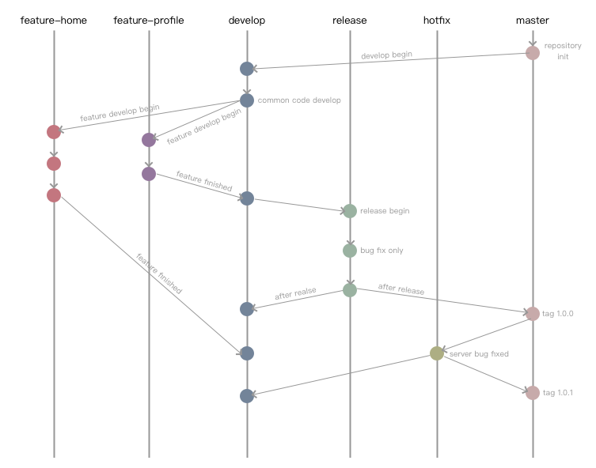
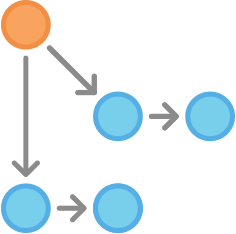
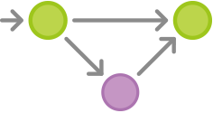

概念

首先这种工作流会用到以下几种分支：

- **master**，主分支，创建 Repository 时默认会生成一个 master 分支。通常情况下 master 分支是受保护的（Protected）。master 分支保存的是稳定的已发布到线上的代码，会使用 tag 来记录发布的版本。master 分支是不允许提交代码的，只能将代码合并（merge）到 master。
- **develop**，开发分支，从 master 创建。需要注意的是，通常情况下，我们只在 develop 上开发一些基础的代码。而对于一些新的功能，我们是不会在 develop 上开发的，因为你不能确定这些是否需要上线（或者说无法确定在哪次迭代上线）。
- **feature**，功能分支，从 develop 创建。feature 分支是用来开发新功能的，通常情况下新功能开发完毕后会合并的 develop。
- **release**，发布分支 从 develop 创建。当一次迭代的功能开发并自测完成后，就可以创建发布分支。该分支通常用于测试，我们不能在该分支上完成除 Bug 修复外的其他工作。测试完成后，我们需要将 release 分支合并到 master 进行发布。发布完成后在 master 打上 tag 记录此次发布的版本，并将 hotfix 合并到 develop。
- **hotfix**，修复分支，从 master 创建。当我们发现线上 Bug 时，会从 master 分支上对应的 tag 处创建新的 hotfix 分支，用来修复 bug。通常情况下，紧急修复的发布相对简单，在 Bug 修复并测试完成后，可直接合并到 master 进行发布。发布完成后在 master 打上 tag 记录此次发布的版本，并将 hotfix 合并到 develop。

**Workflow**

对于工作流，用图来表示会更容易理解，如下图：



# 常用命令


- **创建分支**

```
git branch (branchname)//创建分支
git branch -d (branchname)//删除分支
```

- **切换分支**

```
git checkout (branchname)//切换分支
git checkout -b (branchname) //创建新分支并立即切换到该分支下
```

- **合并分支**

```
git merge 
```

- **列出分支**

```
git branch
```


# 开发实例

　　**创建develop分支**

　****

 

　　第一步是给默认的master配备一个develop分支。一种简单的做法是：让一个开发者在本地建立一个空的develop分支，然后把它推送到服务器。

```
git branch develop
git push -u origin develop
```

　　develop分支将包含项目的所有历史，而master会是一个缩减版本。现在，其他开发者应该克隆（clone）中央仓库，并且为develop创建一个追踪分支。

```
git clone ssh://user@host/path/to/repo.git
git checkout -b develop origin/develop
```

**A和B开发新功能**

　　****

 

　　分别开发新功能开始。他们俩各自建立了自己的分支。**注意**，他们在创建分支时，父分支不能选择master，而要选择develop。

```
git checkout -b some-feature develop
```

　　他们俩都在自己的功能开发分支上开展工作。通常就是这种Git三部曲：edit，stage，commit：

```
git status
git add <some-file>
git commit
```

　　**A把他的功能开发好了**

　　****

 

　　在提交过几次代码之后，A觉得他的功能做完了。如果她所在的团队使用“拉拽请求”，此刻便是一个合适的时机——她可以提出一个将她所完成的功能合并入develop分支的请求。要不然，她可以自行将她的代码合并入本地的develop分支，然后再推送到中央仓库，像这样：

```
git pull origin develop
git checkout develop
git merge some-feature
git push
git branch -d some-feature
```

　　第一条命令确保了本地的develop分支拥有最新的代码——这一步必须在将功能代码合并之前做！**注意**，新开发的功能代码永远不能直接合并入master。必要时，还需要解决在代码合并过程中的冲突。

　　A**开始准备一次发布**

****

 

　　

　　尽管B还在忙着开发他的功能，A却可以开始准备这个项目的第一次正式发布了。类似于功能开发，她使用了一个新的分支来做产品发布的准备工作。在这一步，发布的版本号也最初确定下来。

```
git checkout -b release-0.1 develop
```

　　这个分支专门用于发布前的准备，包括一些清理工作、全面的测试、文档的更新以及任何其他的准备工作。它与用于功能开发的分支相似，不同之处在于它是专为产品发布服务的。

　　一旦A创建了这个分支并把它推向中央仓库，这次产品发布包含的功能也就固定下来了。任何还处于开发状态的功能只能等待下一个发布周期。

　　**A完成了发布**

　　****

 

　　

　　一切准备就绪之后，A就要把发布分支合并入master和develop分支，然后再将发布分支删除。**注意**，往develop分支的合并是很重要的，因为开发人员可能在发布分支上修复了一些关键的问题，而这些修复对于正在开发中的新功能是有益的。再次提醒一下，如果A所在的团队强调代码评审（Code Review），此时非常适合提出这样的请求。　　

```
git checkout master
git merge release-0.1
git push
git checkout develop
git merge release-0.1
git push
git branch -d release-0.1
```

　　发布分支扮演的角色是功能开发（develop）与官方发布（master）之间的一个缓冲。无论什么时候你把一些东西合并入master，你都应该随即打上合适的标签。

```
git tag -a 0.1 -m"Initial public release" master
git push --tags
```

　　Git支持钩子（hook）的功能，也就是说，在代码仓库里某些特定的事件发生的时候，可以执行一些预定义的脚本。因此，一种可行的做法是：在服务器端配置一个钩子，当你把master推送到中央仓库或者推送标签时，Git服务器能为产品发布进行一次自动的构建。

　　**用户发现了一个bug**

　　

　　当一次发布完成之后，A便回去与B一起开发其他功能了。突然，某个用户提出抱怨说当前发布的产品里有一个bug。为了解决这个问题，A（或者B）基于master创建了一个用于维护的分支。她在这个分支上修复了那个bug，然后把改动的代码直接合并入master。　

```
git checkout -b issue-#001 master
# Fix the bug
git checkout master
git merge issue-#001
git push
```

　　跟用于发布的分支一样，在维护分支上的改动也需要合并入develop分支，这一点是很重要的！因此，小马务必不能忘了这一步。随后，她就可以将维护分支删除。

```
git checkout develop
git merge issue-#001
git push
git branch -d issue-#001
```

　　上面介绍的是git flow 的详细过程，但是这样开发起来会接的是否麻烦，git flow对其进行了封装简化。

**使用**

- - **初始化:** git flow init
  - **开始新Feature:** git flow feature start MYFEATURE
  - **Publish一个Feature(也就是push到远程):** git flow feature publish MYFEATURE
  - **获取Publish的Feature:** git flow feature pull origin MYFEATURE
  - **完成一个Feature:** git flow feature finish MYFEATURE
  - **开始一个Release:** git flow release start RELEASE [BASE]
  - **Publish一个Release:** git flow release publish RELEASE
  - **发布Release:** git flow release finish RELEASE
    别忘了git push --tags
  - **开始一个Hotfix:** git flow hotfix start VERSION [BASENAME]
  - **发布一个Hotfix:** git flow hotfix finish VERSION

```
git flow init
```

　　这个命令会进行一些默认的配置，可以自动创建上面介绍的所有分支：master、develop、feature、relase、hotfix等分支。

　　完成后当前所在分支就变成 develop. 任何开发都必须从 develop 开始:

　　**当进行新功能开发的时候：**

```
git flow feature start some_awesome_feature
```

　　完成功能开发之后:

```
git flow feature finish some_awesome_feature
```

　　该命令将会把feature/some_awesome_feature合并到develope分支，然后删除功能(feature)分支。

　  将一个 feature 分支推到远程服务器

```
git flow feature publish some_awesome_feature 或者 git push origin feature/some_awesome_feature 
```

　　当你的功能点都完成时（需要发布新版本了），就基于develop创建一个发布(release)分支。

```
git flow release start v0.1.0 
```

　　当你在完成（finish)一个发布分支时，它会把你所作的修改合并到master分支，同时合并回develop分支，所以，你不需要担心你的master分支比develop分支更加超前。

　　当系统出现问题的时候，需要进行紧急修改的时候，就好基于master创建一个维护（hotfix）分支。

```
git flow hotfix start v0.1.0
```

　　当你在完成（finish)一个维护分支时，它会把你所作的修改合并到master分支，同时合并回develop分支。