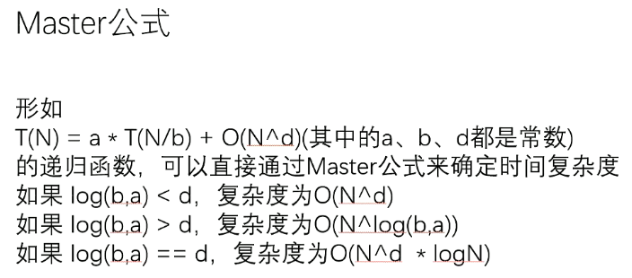

# 递归

递归的思想是将一个大的任务分解成小的任务，小的任务再进一步拆解，直到达到某一个边界，最后经过某种逻辑进行整合，得到整个问题的求解。

递归调用时，使用了系统栈，调用的函数放入栈，执行完返回时就会从栈顶pop出；

任何递归都可以改为迭代。

有一类递归的时间复杂度可以确定，时间复杂度原始形式如下

$$
T(N)=aT(\frac{N}{b})+O(N^d)
$$
a、b、c为常数

a为递归的个数，b为数据被等量的分的程度，d为除递归以为的复杂度

比如：二分法a=2，b=2，d=0

即条件为：**子问题的规模是一致的**。

时间复杂度公式如下

