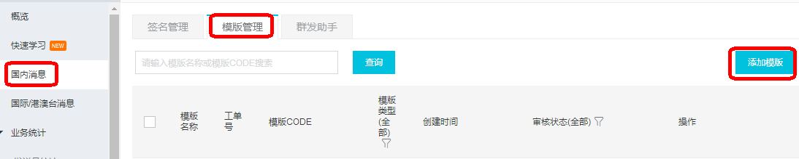
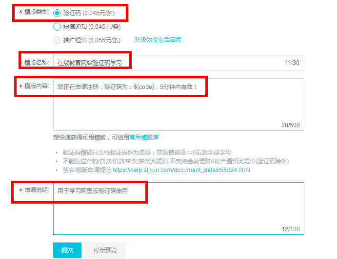
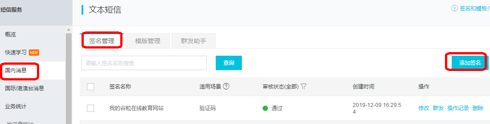
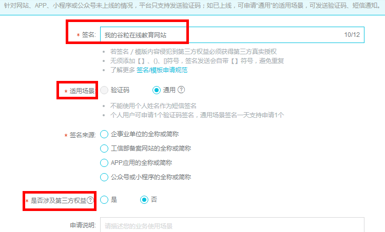

# 一、阿里云短信服务

## 1、开通阿里云短信服务

**2**、**添加签名管理与模板管理**

**（1）添加模板管理**

**选择 国内消息 - 模板管理 - 添加模板**



**点击 添加模板，进入到添加页面，输入模板信息**



**点击提交，等待审核，审核通过后可以使用**

**（2）添加签名管理**

**选择 国内消息 - 签名管理 - 添加签名**



**点击添加签名，进入添加页面，填入相关信息注意：签名要写的有实际意义**

**点击提交，等待审核，审核通过后可以使**

**三、编写发送短信接口1、在service-msm的pom中引入依赖**

```xml
<dependencies>
    <dependency>
        <groupId>com.alibaba</groupId>
        <artifactId>fastjson</artifactId>
    </dependency>
    <dependency>
        <groupId>com.aliyun</groupId>
        <artifactId>aliyun-java-sdk-core</artifactId>
    </dependency>
</dependencies>
```

**2、编写controller，根据手机号发送短信**

```java
@RestController
@RequestMapping("/api/msm")
@CrossOrigin //跨域
public class MsmApiController {

    @Autowired
    private MsmService msmService;

    @Autowired
    private RedisTemplate<String, String> redisTemplate;

    @GetMapping(value = "/send/{phone}")
    public R code(@PathVariable String phone) {
        String code = redisTemplate.opsForValue().get(phone);
        if(!StringUtils.isEmpty(code)) return R.ok();

        code = RandomUtil.getFourBitRandom();
        Map<String,Object> param = new HashMap<>();
        param.put("code", code);
        boolean isSend = msmService.send(phone, "SMS_180051135", param);
        if(isSend) {
            redisTemplate.opsForValue().set(phone, code,5,TimeUnit.MINUTES);
            return R.ok();
        } else {
            return R.error().message("发送短信失败");
        }
    }
}
```

**3、编写service**

```java
 @Service
public class MsmServiceImpl implements MsmService {

    /**
     * 发送短信
     */
    public boolean send(String PhoneNumbers, String templateCode, Map<String,Object> param) {

        if(StringUtils.isEmpty(PhoneNumbers)) return false;

        DefaultProfile profile =
                DefaultProfile.getProfile("default", "LTAIq6nIPY09VROj", "FQ7UcixT9wEqMv9F35nORPqKr8XkTF");
        IAcsClient client = new DefaultAcsClient(profile);

        CommonRequest request = new CommonRequest();
        //request.setProtocol(ProtocolType.HTTPS);
        request.setMethod(MethodType.POST);
        request.setDomain("dysmsapi.aliyuncs.com");
        request.setVersion("2017-05-25");
        request.setAction("SendSms");

        request.putQueryParameter("PhoneNumbers", PhoneNumbers);
        request.putQueryParameter("SignName", "我的谷粒在线教育网站");
        request.putQueryParameter("TemplateCode", templateCode);
        request.putQueryParameter("TemplateParam", JSONObject.toJSONString(param));

        try {
            CommonResponse response = client.getCommonResponse(request);
            System.out.println(response.getData());
            return response.getHttpResponse().isSuccess();
        } catch (ServerException e) {
            e.printStackTrace();
        } catch (ClientException e) {
            e.printStackTrace();
        }
        return false;
    }
}
```

